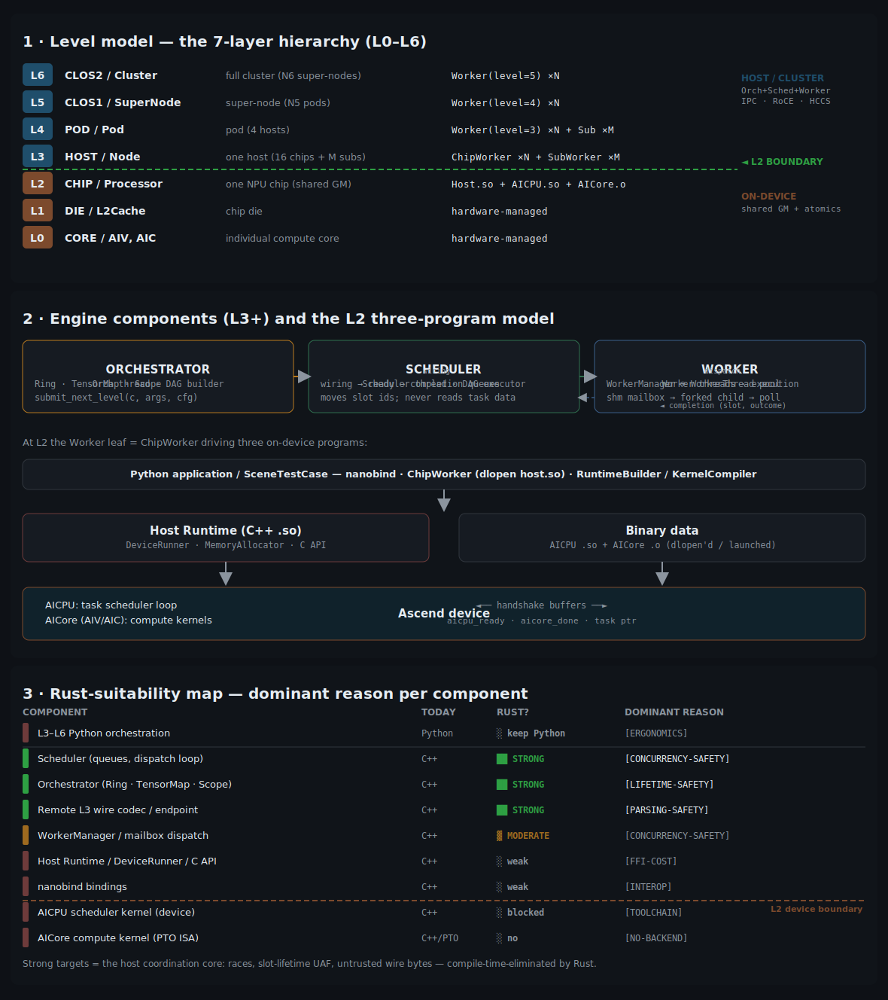

# SIMPLER / PTO Runtime — Architecture Review & Rust-Suitability Analysis

A review of the `simpler` project (HiSilicon PTO Runtime): the 7-layer level
model, the chip-level three-program model, architectural diagrams, and a
component-by-component analysis of where Rust would (and would not) help.

> Scope note: this is an external review for discussion. The project today is
> ~131 k LOC C++ + ~40 k LOC Python, **zero Rust**. Nothing here proposes a
> rewrite; it maps where Rust's guarantees would pay off if components were
> (re)written, and labels each with the **single dominant reason**.



> The three panels above are rendered from [`diagrams/make_diagrams.py`](diagrams/make_diagrams.py)
> (`python3 docs/diagrams/make_diagrams.py` regenerates `diagrams/architecture.svg`). The ASCII
> versions below are the same diagrams inline.

---

## 1. What SIMPLER is

A **task-graph runtime** that builds and executes DAGs of compute tasks on
Ascend NPU clusters, coordinating **AICPU** (on-device control processor) and
**AICore** (AIV vector / AIC cube compute) execution. Three independently
compiled programs — Host `.so`, AICPU `.so`, AICore `.o` — cooperate through
narrow C APIs, with a Python orchestration layer on top.

Two orthogonal axes structure the codebase:

- **Level**: L0 (core) → L6 (cluster) — a 7-layer hierarchy mirroring physical
  topology.
- **Program**: Host / AICPU / AICore — the three-program model at the L2 chip
  boundary.

---

## 2. The 7-layer level model (L0–L6)

```text
 LEVEL   NAME              UNIT                         RUNTIME COMPONENT             WORLD
 ─────   ────────────────  ───────────────────────────  ────────────────────────────  ─────────────
 L6   ▒  CLOS2 / Cluster   full cluster (N6 super-nodes) Worker(level=5) ×N            ┐
 L5   ▒  CLOS1 / SuperNode super-node (N5 pods)          Worker(level=4) ×N            │ HOST / CLUSTER
 L4   ▒  POD   / Pod       pod (4 hosts)                 Worker(level=3) ×N + Sub ×M   │ (Orchestrator +
 L3   ▒  HOST  / Node      one host (16 chips + M subs)  ChipWorker ×N + SubWorker ×M  │  Scheduler + Worker,
         ─────────────────────────────────────────────────────────────────────────── │  IPC / RoCE / HCCS)
 L2   █  CHIP  / Processor one NPU chip (shared GM)      Host.so + AICPU.so + AICore.o ┘ ← THE BOUNDARY
 L1   ░  DIE   / L2Cache   chip die                      hardware-managed              ┐ ON-DEVICE
 L0   ░  CORE  / AIV,AIC   individual compute core       hardware-managed              ┘ (shared GM + atomics)
```

**L2 is the boundary** between two worlds:

- **L0–L2 (on-device)**: AICPU scheduler + AICore workers + device Global
  Memory. Coordination by shared GM, atomics, barriers, and the
  AICPU↔AICore **handshake protocol**. Hard real hardware constraints apply
  (e.g. AICore *cannot* write `DATA_MAIN_BASE`; MMIO reads are strictly serial
  at ~95 ns each).
- **L3–L6 (host/cluster)**: every level runs the **same** scheduling engine —
  one `Worker` C++ class handles L3 upward; `level` is just a diagnostic label.
  Composition is **recursive**: a parent Worker schedules child Workers through
  the identical mailbox protocol L3 uses for chip children. Local composition
  via fork + shared memory; cross-host (L4–L6) via RoCE / HCCS / UB / sockets.

Maturity, per the docs: L3 implemented; L4 local implemented + remote
simulation; L5/L6 reuse the L4 code path (untested) / remote proposed.

---

## 3. The three engine components (L3+) and the L2 three-program model

Every level L3+ composes three cooperating components, each on its own thread:

```text
   ORCHESTRATOR (Orch thread)        SCHEDULER (Scheduler thread)     WORKER (Worker threads)
   ─────────────────────────         ───────────────────────────      ──────────────────────
   DAG builder. Runs on the          DAG executor. Drains 3 queues:    Execution layer.
   user's thread. Owns:              · wiring  (wire fanout edges)     WorkerManager holds
   · Ring     (slot pool)            · ready   (fanin satisfied →      WorkerThread pools.
   · TensorMap(dep inference)                   pick idle worker)      Each encodes (callable,
   · Scope    (tensor lifetime)      · completion (release fanout)     config, args) into a shm
                                      Never inspects task data —        mailbox → signals the
   submit_next_level(c, args, cfg)   only moves slot ids + reads        forked child → spin-polls
     → alloc, dep-infer, push         TaskSlotState metadata.            TASK_DONE.
       wiring_queue ─────────────────►                ─────────────────►
                                                       ◄──── completion (slot, outcome)
```

At **L2**, the "Worker" leaf is a `ChipWorker` that drives the three on-device
programs:

```text
        ┌──────────────────────── Python application / SceneTestCase ───────────────────────┐
        │  nanobind (task_interface)   ChipWorker(dlopen host.so)   RuntimeBuilder/KernelCompiler │
        └───────────────┬───────────────────────┬───────────────────────────┬─────────────────┘
                        │                        │                           │ (compile)
                        ▼                        ▼                           ▼
        ┌──────── Host Runtime (C++ .so) ────────┐              ┌──── Binary data (AICPU.so + AICore.o) ────┐
        │ DeviceRunner · MemoryAllocator · C API │  loads ──►   │   dlopen'd / launched at runtime          │
        └───────────────────────┬────────────────┘              └───────────────────┬───────────────────────┘
                                │                                                    │
                                ▼                       Ascend device                ▼
                 ┌──────────────────────────────────────────────────────────────────────────┐
                 │  AICPU: task scheduler loop   ◄── handshake buffers (aicpu_ready /         │
                 │  AICore (AIV/AIC): kernels         aicore_done / task ptr) ──►  compute    │
                 └──────────────────────────────────────────────────────────────────────────┘
```

**Two platform backends** (`onboard/` real hardware, `sim/` thread-based host
simulation) and **two runtimes** (`host_build_graph` = graph built on host CPU,
for dev/debug; `tensormap_and_ringbuffer` = graph built on AICPU/device, for
production) sit under `src/{arch}/{platform,runtime}/`.

**Python/C++ division** (from the docs): *Python decides **when**
(fork ordering, `SharedMemory` lifecycle, callable registration); C++ decides
**how fast** (threading, atomics, zero-copy dispatch).*

---

## 4. Where Rust fits — component-by-component

Reading the layers top-to-bottom, here is each component, its current
language, and the **one dominant reason** Rust would or would not help. The
label in **bold** is the headline reason.

```text
 ════════════════════════════════════════════════════════════════════════════════════════════
 LAYER / COMPONENT                       TODAY    RUST?         DOMINANT REASON (label)
 ════════════════════════════════════════════════════════════════════════════════════════════
 L3–L6 orchestration / user DAG fn       Python   ✗ keep Py    [ERGONOMICS] dynamic user API,
   (python/simpler/{worker,orchestrator})                       fork timing, torch interop
 ────────────────────────────────────────────────────────────────────────────────────────────
 Scheduler engine (queues, dispatch      C++      ✓✓ STRONG    [CONCURRENCY-SAFETY] lock-free-ish
   loop, TaskSlotState)                                          queues across Orch/Sched/Worker
   src/common/hierarchical/scheduler                            threads — data races are the bug
                                                                 class Rust's Send/Sync removes
 ────────────────────────────────────────────────────────────────────────────────────────────
 Orchestrator (Ring, TensorMap, Scope,   C++      ✓✓ STRONG    [LIFETIME-SAFETY] Scope = tensor
   slot state machine)                                          lifetimes + slot reuse; the exact
   src/common/hierarchical/{ring,                                use-after-free / aliasing class
   tensormap,scope,orchestrator}                                 ownership/borrow encodes
 ────────────────────────────────────────────────────────────────────────────────────────────
 WorkerManager / WorkerThread + shm      C++      ✓ MODERATE   [CONCURRENCY-SAFETY] thread pool +
   mailbox dispatch                                             mailbox state machine; but raw shm
   src/common/hierarchical/worker_manager                       + fork interop needs heavy `unsafe`
 ────────────────────────────────────────────────────────────────────────────────────────────
 Remote L3 transport: endpoint + wire    C++      ✓✓ STRONG    [PARSING-SAFETY] versioned frame
   codec (RoCE/HCCS/UB/sockets)                                 codec over the network = untrusted
   src/common/hierarchical/remote_{endpoint,wire}               bytes; Rust parsers reject malformed
                                                                 input without memory-unsafety
 ────────────────────────────────────────────────────────────────────────────────────────────
 Host Runtime: DeviceRunner,             C++      ~ WEAK       [FFI-COST] thin wrapper over CANN
   MemoryAllocator, C API                                       C SDK (rtSetDevice, dlsym); Rust
   src/{arch}/platform/*/host                                   adds FFI noise for little safety win
 ────────────────────────────────────────────────────────────────────────────────────────────
 AICPU scheduler kernel (device .so)     C++      ~ WEAK*      [TOOLCHAIN] must compile with CANN's
   src/{arch}/platform/*/aicpu                                  AICPU toolchain; no Rust target.
                                                                 *Logic is race-heavy → Rust would
                                                                  help IF a target existed
 ────────────────────────────────────────────────────────────────────────────────────────────
 AICore compute kernel (device .o)       C++/PTO  ✗ NO         [NO-BACKEND] PTO ISA via CCEC; no
   src/{arch}/platform/*/aicore                                 Rust/LLVM backend for AICore. This
                                                                 is the kernel-safety story of the
                                                                 *other* project (ascend-rs), not a
                                                                 runtime concern
 ────────────────────────────────────────────────────────────────────────────────────────────
 Python↔C++ bindings (nanobind)          C++      ~ WEAK       [INTEROP] nanobind is mature; a Rust
   python/bindings/task_interface.cpp                          PyO3 equivalent only pays off if the
                                                                 bound engine is already Rust
 ════════════════════════════════════════════════════════════════════════════════════════════
```

### The labels, expanded

- **[CONCURRENCY-SAFETY] — Scheduler & WorkerManager (strongest case).**
  The Scheduler runs a dedicated thread draining three queues shared with the
  Orch thread and N WorkerThreads, coordinated by mutex+CV and atomics over
  `TaskSlotState`. This is precisely the class of bug — data races, torn reads
  of slot state, missed wakeups — that Rust's `Send`/`Sync` + borrow checker
  turn into *compile errors*. **Main reason to use Rust: fearless concurrency on
  the hot scheduling path.**

- **[LIFETIME-SAFETY] — Orchestrator (Ring / TensorMap / Scope).**
  `Scope` manages intermediate-tensor lifetimes; `Ring` reuses fixed slots with
  back-pressure; `TensorMap` maps a producer slot to consumers. A slot freed
  while a downstream consumer still references it is a use-after-free — the
  *same* hazard class the companion `ascend-rs` work shows Rust ownership
  rejects at compile time. **Main reason: ownership/lifetimes make
  slot-reuse-after-free unrepresentable.**

- **[PARSING-SAFETY] — Remote L3 wire codec.**
  `remote_wire.cpp` is a versioned frame codec for cross-host task frames over
  RoCE/HCCS/UB/sockets — i.e. it decodes **bytes off the network**. Hand-rolled
  C++ binary parsers are a perennial CVE source (overreads, length confusion).
  **Main reason: safe decoding of untrusted/versioned input.**

- **[FFI-COST] — Host Runtime / C API.** `DeviceRunner` is a thin handle-based
  wrapper over CANN C calls (`rtSetDevice`, stream sync, `dlsym`). Rewriting in
  Rust means wrapping all of CANN in `extern "C"` + `unsafe` — the safety upside
  is small and the FFI tax is real. **Main reason *not* to: it's mostly FFI
  glue, where Rust's guarantees are voided by `unsafe` anyway.**

- **[TOOLCHAIN] — AICPU kernel.** Logically this is *also* a race-heavy
  scheduler (it would benefit from Rust), but it must be built by CANN's AICPU
  compiler; there is no Rust target for the AICPU. **Main reason *not* to:
  no toolchain, regardless of merit.**

- **[NO-BACKEND] — AICore kernel.** Compiled to PTO ISA via CCEC; no
  Rust/LLVM AICore backend exists. (This is exactly the boundary the *separate*
  `ascend-rs` project addresses with a shape-typed Rust model + an IR-level
  oracle — out of scope for this runtime.) **Main reason *not* to: no code
  generation path to the device.**

- **[ERGONOMICS] — Python orchestration layer.** The user writes orch
  functions in Python; the layer also owns `fork()` timing, `SharedMemory`
  alloc/unlink, and torch zero-copy interop. This is "decide *when*" glue where
  Python's dynamism and ecosystem win. **Main reason to keep Python: user-facing
  API + lifecycle orchestration, not throughput.**

---

## 5. Summary picture — Rust suitability over the architecture

```text
                         RUST SUITABILITY  (██ strong · ▓ moderate · ░ weak/no)
 ┌─────────────────────────────────────────────────────────────────────────────────┐
 │ L3–L6  Python orchestration ........... ░  keep Python   [ERGONOMICS]             │
 │ ┌──────────────────────── host/cluster engine (C++) ───────────────────────────┐ │
 │ │ Scheduler (queues, dispatch) ........ ██  STRONG        [CONCURRENCY-SAFETY]   │ │
 │ │ Orchestrator (Ring/TensorMap/Scope) . ██  STRONG        [LIFETIME-SAFETY]      │ │
 │ │ Remote wire codec / endpoint ........ ██  STRONG        [PARSING-SAFETY]       │ │
 │ │ WorkerManager / mailbox dispatch .... ▓   MODERATE      [CONCURRENCY-SAFETY]   │ │
 │ │ Host Runtime / DeviceRunner / C API . ░   weak          [FFI-COST]             │ │
 │ │ nanobind bindings ................... ░   weak          [INTEROP]              │ │
 │ └──────────────────────────────────────────────────────────────────────────────┘ │
 │ ════════════════════════ L2 device boundary ════════════════════════════════════ │
 │ AICPU scheduler kernel ................ ░   blocked       [TOOLCHAIN]              │
 │ AICore compute kernel (PTO ISA) ....... ░   no            [NO-BACKEND]             │
 └─────────────────────────────────────────────────────────────────────────────────┘
```

**Bottom line.** The high-value Rust targets are the **host-side coordination
core** — Scheduler, Orchestrator, and the remote wire codec — where the bug
classes are exactly concurrency races, slot-lifetime use-after-free, and
untrusted-input parsing that Rust eliminates at compile time. The device side
(AICPU/AICore) is blocked by toolchain/backend availability, not by merit, and
the Python layer is best left as the ergonomic "when" layer. A pragmatic first
step would be a single Rust crate replacing `src/common/hierarchical/`
(scheduler + orchestrator + ring/tensormap/scope + remote_wire), exposed to the
existing Python via PyO3 — leaving the CANN FFI host runtime and the device
kernels in C++.
```
