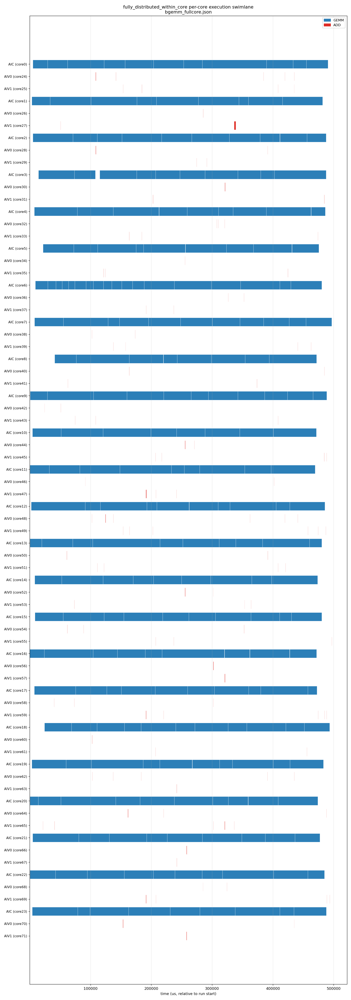

# AICore 上的全分布式 Runtime

本文档定义 **simpler** 的一种运行模式：编排（orchestration）、调度（scheduling）
与执行（execution）全部以 SPMD 方式运行**在 AICore 自身**之上，**AICPU 完全不参与**。
不存在独立的调度器：每个核自行构建、拥有并执行自己的任务。

这是一份自洽的设计。第一部分描述系统如何工作（核的行为 + 伪代码）；第二部分列举
各数据结构及其共享特性（全局共享 / 每核私有 / 每核复制）。

本设计所替代的、当前以 AICPU 为中心的模型，参见
[chip-level-arch.md](chip-level-arch.md) 与 [scheduler.md](scheduler.md)。编排编写
API（`rt_submit_aic_task` / `rt_submit_aiv_task`，`pto_orchestration_api.h`）参见
`src/{arch}/runtime/` 下的 `tensormap_and_ringbuffer` runtime。

---

# 第一部分 — 系统设计

## 1. 概述

- 编排函数**被加载并同时运行在每一个参与的 AICore 上**（SPMD）。所有核执行完全相同
  的编排程序。
- 每个核同时是**编排器 + 调度器 + worker**。经典的“调度器↔worker”握手（任务门铃、
  ready 队列、完成邮箱、依赖连线线程）被**彻底取消**。
- 面向编排的 API 保持不变。通用原语是 `rt_submit_task(MixedKernels, args)`；
  `rt_submit_aic_task` / `rt_submit_aiv_task` 只是它的轻量便捷封装（**不存在**
  `rt_submit_mixed_task`——MIX 任务就是一个填了多个 kernel 槽的 `MixedKernels`）。
  在这些 API 背后，runtime 决定所有权、在本地构建任务，随后由同一个核执行它。
- AICPU 不在编排与调度的关键路径上。

本设计建立在以下四个支柱之上（下文逐一展开）：

1. 任务所有权的**抢占竞争（claim race）**（§2）。
2. **owner = builder = executor**，并配合核类型匹配（§3）。
3. 用于依赖发现的**每核全量复制 TensorMap**（§4）。
4. **每核私有任务环 + 一个全局完成标志环**，驱动一个采用拉取式依赖解析的
   run-ahead 执行循环（§5–§6）。

## 2. 任务所有权 —— 抢占竞争（Claim Race）

所有核走**完全相同**的、确定性的 submit 序列。任务身份就是它在该序列中的位置：第 N 次
`rt_submit_*` 调用在每个核上都是**任务 id `N`**，与最终由谁执行无关。

所有权由以下两个量驱动：

| 计数器 | 作用域 | 含义 |
| ------ | ------ | ---- |
| `claim_cursor[T]`（`cube_cursor`、`vector_cursor`） | **全局、原子** | 类型 `T` 已被认领任务 id 的高水位线。共**两个** cursor（cube = AIC-anchored，vector = AIV-only），二者都索引同一个共享 id 空间（§3.1） |
| `local_current_task_index` | **每核** | 本核走 submit 序列时当前到达的任务 id |

每次 `rt_submit_*`，匹配 anchor 类型的核执行如下逻辑（设 `T` 为此任务类型——若 AIC-anchored
则为 cube，若 AIV-only 则为 vector）：

```text
local_current_task_index++                        # 到达下一个 submit 点 = 任务 id N
if local_current_task_index > claim_cursor[T]:    # 我是否领先于 T 的高水位线？
    # 本核是 T 类型中走得最靠前的 → 它 WIN，拥有任务 N。
    claim_cursor[T] = local_current_task_index     # 发布（原子）
    own = true
else:
    # 已有一个 T 类型的核更早认领了此 id（它跑在前面）。
    own = false
```

胜者是该任务 id 的唯一 owner。所有权决定的是*谁来构建与执行*；它**不会**改变任务 id——
该 id 是处处使用的确定性 submit 序号（完成标志环的索引、以及每个核的 producer 引用）。
对于多核任务，胜者是 *anchor*；与它配对的同 block 核共同拥有其余子任务（§3.1）。

为什么需要两个 cursor（以及为什么单一共享 cursor 是错的）在 §3.1 解释：两个 cursor 扫过
同一 id 空间，各自只认领自己类型的 id，并**跨过**另一类型的 id，因此落后类型尚未认领的
id 只是在等待它自己的 cursor —— 它们绝不会被跳过。

> 确切原子原语（`atomic_fetch_max`，无则 CAS 回路）与内存序在 §11.1 定为规范；
> 语义上每个任务 id 恰好有一个 anchor 胜出。

## 3. owner = builder = executor；核类型匹配

**抢到任务的提交者就是它的 owner。** owner 同时负责任务的**创建**（构建
descriptor/payload、记录 fan-in producer id）与**执行**（调用 incore 函数）。一个核只会
认领它自己能执行的类型的任务。

任务由 `MixedKernels` 描述，最多携带三个子任务槽：

```cpp
struct MixedKernels {
    int32_t aic_kernel_id  { INVALID_KERNEL_ID };   // AIC 子任务
    int32_t aiv0_kernel_id { INVALID_KERNEL_ID };   // AIV 子任务 0
    int32_t aiv1_kernel_id { INVALID_KERNEL_ID };   // AIV 子任务 1
};
```

`active_mask` = 哪些槽有效，它恰好记录了一个 MIX 任务的 AIV 数量——**1C+1V**
（`aic` + `aiv0`）还是 **1C+2V**（`aic` + `aiv0` + `aiv1`）。这一区分对所有权很关键：
1C+1V 任务只绑定 AIV0_c，让 AIV1_c 保持空闲（§3.1）。因此任务是以下之一：AIC-only、
AIV-only（1 个或 2 个 AIV 子任务）、或 **MIX**（AIC + 1 个或 2 个 AIV 子任务）。

| 任务形态 | 子任务槽 | owner |
| -------- | -------- | ----- |
| **AIC-only** | `aic` | 任意一个 AIC 核 |
| **AIV-only (1V)** | `aiv0` | **任意一个 AIV 核（AIV0 或 AIV1）** |
| **AIV-only (2V)** | `aiv0`、`aiv1` | 同一 block 的两个 AIV 核 |
| **MIX (1C+1V)** | `aic`、`aiv0` | 一个 AIC + 同 block 一个 AIV（共同 owner） |
| **MIX (1C+2V)** | `aic`、`aiv0`、`aiv1` | 一个 AIC + 同 block 两个 AIV（共同 owner） |

单槽封装（`rt_submit_aic_task` → 填 `aic`，`rt_submit_aiv_task` → 填 `aiv0`）是常见路径；
多槽任务直接走 `rt_submit_task(MixedKernels, …)`。

**单核 vs 多核——竞争资格按“类型”而非“固定槽角色”。** 竞争一个任务的资格由任务**类型**
（cube / vector）决定，而非某个具体的 `aiv0`/`aiv1` 角色：

- **单核任务（1C、1V）**：没有配对、没有 anchor/follower。任意一个**匹配类型**的核通过 §2 的
  claim race 认领，胜者独自构建并执行那唯一的子任务。特别地，**1V（AIV-only 单核）由所有 AIV 核
  竞争——AIV0 与 AIV1 同等参与**；胜者执行 `aiv0_kernel_id`，与它在 block 中是 AIV0 还是 AIV1
  无关（两者都是 vector 核，可执行任意 AIV kernel）。
- **多核任务（2V、MIX）**：需要同一物理 block 的多个核共同拥有，走 §3.1 的固定配对（anchor 胜出
  后把其余子任务推送给同 block 伙伴）。

换言之，`aiv0`/`aiv1` 的“固定角色”**只**在多核任务里用来把子任务映射到 block 内具体的核；对单核
任务它不构成竞争限制。

### 3.1 通过固定物理配对实现多核任务的共同所有权

本节**只针对多核任务**（任意 MIX 任务，以及 2V 的 AIV-only 情况）——它们含多于一个有效子任务
槽，必须被多个核同时拥有。单核任务（1C、1V）不走本节机制：由任意匹配类型的核（1V 即任意 AIV 核
AIV0/AIV1）通过 §2 的 claim race 直接认领、独自执行，无 anchor/follower。本节规定多核任务的
共同 owner 如何被选出、如何达成一致——这是模型中最难的部分。

**配对被 FIXED（固定）到硬件 block。** 核被组织成硬件 block（cluster）；在本平台上一个
block = **1 AIC + 2 AIV**（AIV0、AIV1）。这个 block 是永久的共同所有权单位：AIC_c 与
AIV0_c、AIV1_c 静态配对。不存在动态配对选举。子任务槽到 block 内角色是固定映射：

| 子任务槽 | 由谁执行（block `c` 内） |
| -------- | ------------------------ |
| `aic_kernel_id` | AIC_c |
| `aiv0_kernel_id` | AIV0_c |
| `aiv1_kernel_id` | AIV1_c |

**Anchor + 同 block 跟随规则。** 一个多核任务只被**认领一次**，由一个 *anchor* 核认领；
其 block 的其余核跟随：

1. **谁竞争（anchor 类型）**：竞争按任务**类型** `T` 进行——含 AIC 子任务的任务（所有 MIX）
   是 **cube 类型，只有 AIC 核竞争**；纯 AIV 的 2V 是 **vector 类型，由所有 AIV 核（AIV0/AIV1）
   竞争**。胜出者即该任务的 **anchor**，它执行**自己物理角色**对应的那个槽（AIC 胜者执行 `aic`；
   2V 由某个 AIV 胜出则执行它自己角色的 `aiv0`/`aiv1`），其余激活槽推送给同 block 伙伴。
   **MIX 的 vector co-owner 绝不靠自己竞争得来**——它*完全*由“哪个 AIC 胜出”决定，即由胜者
   所在的 block 决定（一个 AIV 核绝不会因为先到达就赢得某 MIX 的 vector 子任务）。
2. 抢占竞争（§2）**仅在 anchor 类型之间**进行，竞争对象是 `cursor[T]`。胜出的 anchor 核
   所在的 **block** 成为拥有该任务的 block。anchor 在胜出时**一次性解析整个任务的 fan-in**
   producer id（从它在 `N` 处的 TensorMap 副本读取，各核内容相同——§4），把*自己*那个槽的
   子任务构建进自己的私有环，并把该任务**其余激活槽**的子任务记录**推送（deposit）**进一张
   **以任务 id 为键的 block-local 投递表** —— `block.won[N]` —— 内容为
   `{active_mask = M, 各激活槽 kernel id, args, 已解析的 fan-in producer id, 剩余子任务计数
   = popcount(M)}`。
3. 同 block 的 follower 核**既不竞争、也不在自己的编排走位上对该任务做“等待 anchor 决定”
   的判断**——它**永不因 anchor 而阻塞**。follower 的所有权完全靠 anchor 的**推送**到达：
   follower **异步地从 `block.won` 抽取（drain）**属于自己槽的子任务投递，在私有环有空槽时
   把它构建进环。follower 在自己的编排走位中遇到 MIX 任务时，只做 §4 的无条件 TensorMap
   更新，然后继续前进，**不**对该 MIX 任务做任何所有权决定、**不**等待它的 anchor。

**为什么是 anchor 推送，而不是 follower 自己走位 + 等待。** 两个 cursor 独立推进（§2），所以
cube 与 vector 的进度可能任意错位。若让 follower 在自己的走位上“走到 N 再判断我的 block 是否
赢了 N”，当它的 anchor 落后（`cube_cursor < vector_cursor`）时，follower 就无法区分“anchor
还没决定 N”与“anchor 输了 N（别的 block 赢了）”，只能**阻塞等待** anchor 推进到 N——这会把
vector 的吞吐死死耦合到 cube 的吞吐上，是不可接受的。**改为 anchor 推送即彻底消除这种 per-task
阻塞**：

- **cube 落后时**：`block.won` 里还没有给这个 AIV 的 MIX 投递 → AIV **不等待**，继续竞争并执行
  它自己的 AIV-only 任务（以及抽取已到的其他投递）。零停顿。
- **cube 领先时**：投递在 `block.won` 中累积 → AIV 有空槽就抽取构建。若 AIV 落后到填满
  `block.won`，则 anchor **暂缓认领新的多核任务**（反压；见 §6 中 anchor 转去执行 Phase B 而
  非自旋），方向正确：不让 cube 无限超前。

`block.won` 以任务 id 为键（而非单一会被覆盖的槽），既承载每任务的剩余子任务计数，也允许同一
block 多个并发多核任务的投递互不串扰。由于配对是静态的，投递的目标 follower 由 anchor 所在
block 唯一确定，无需任何跨 block 协商。

> 唯一残留的等待发生在**收尾**：若某 block 的 anchor 严重落后，它的 follower 在做完自己其余
> 全部工作、私有环清空后，可能要在终止前空转，等 anchor 把最后的多核子任务推送过来（§7）。
> 这是固定配对的固有代价——多核子任务的归属由 anchor 的认领决定；它不是 per-task 的串行阻塞，
> 而只是尾部的一次空转，且在 cube 密集（cube 领先）的常见场景下根本不出现。

**按形态的行为（设胜出 anchor 在 block `c`）：**

| 任务形态（`active_mask`） | 谁竞争 | Anchor（胜者） | 被推送子任务的 follower | 同 block 未被绑定（保持空闲） |
| ------------------------- | ------ | -------------- | ----------------------- | ----------------------------- |
| **1C + 2V**（多核） | 所有 AIC | AIC_c | AIV0_c、AIV1_c | — |
| **1C + 1V**（多核） | 所有 AIC | AIC_c | AIV0_c | **AIV1_c** |
| **2V**（多核，AIV-only） | 所有 AIV（AIV0/AIV1） | 胜出的那个 AIV_c | 同 block 的另一个 AIV_c | AIC_c |
| **1C**（单核，AIC-only） | 所有 AIC | 胜者独自执行，无配对 | — | （不涉及 block 配对） |
| **1V**（单核，AIV-only） | **所有 AIV（AIV0/AIV1）** | 胜者独自执行，无配对 | — | （不涉及 block 配对） |

多核任务（前三行）的 follower 身份都由 anchor 所在 block 唯一确定——不存在跨 block 协商。单核
任务（后两行）没有 anchor/follower，胜者是哪个核就由哪个核独自执行；**1V 由 AIV0 与 AIV1 同等
竞争**。

**未被绑定的 block 伙伴不是闲着——它对其他任务保持空闲可用。** 当一个 block 赢得一个不激活
某 block 伙伴槽位的任务时，那个核就**不被该任务占用**，且**绝不能**因它而阻塞或等待。它继续
运行自己的编排，继续竞争并拥有其类型的其他任务。具体地：

- 一个 **1C+1V** 任务只绑定 AIC_c + AIV0_c。**AIV1_c 是空闲的**，可继续竞争、认领并执行其他
  AIV 任务（它自己竞争到的任意 1V/2V AIV-only 任务，或本 block 后续某个 1C+2V 任务的 AIV1 槽）。
- 一个 **1C（AIC-only）** 任务只绑定一个 AIC 核；AIV 核**都**对 AIV 工作保持空闲。
- 一个 **1V（AIV-only）** 任务是单核：由**任意一个 AIV 核（AIV0 或 AIV1）**竞争得到并独自执行，
  其余 AIV 核与 AIC 核保持空闲。它不绑定任何固定角色。

这是模型的自然结论：每个核都走相同的确定性 submit 序列，并逐任务判断自己的槽是否激活。在某个
自己的槽未激活的 submit 点，该核就是不绑定该任务（但它仍执行 §4 的无条件 TensorMap 更新），
然后继续——去认领它下一个有资格的任务。每个任务记录的 `active_mask`（1C+1V vs 1C+2V 等）
就是告诉每个 block 伙伴自己是被绑定还是空闲的依据。

**多核任务只有一个完成标志。** 即使有多个共同 owner，一个任务也恰好只有一个全局
`task_completed_flag[N]`。每个共同 owner 执行自己的子任务后，递减 `block.won[N]` 中那个用
`popcount(active_mask)` 初始化的**per-task 剩余计数器**。（该计数器存在以 id 为键的记录里，
而非单一 block 字段，因此同一 block 的多个并发 MIX 任务不会互相串扰。）把计数器递减到零的那个
共同 owner（最后完成的子任务）执行唯一一次全局写 `task_completed_flag[N] = true`。因此无论
任务有多少个子任务，消费者都只看到一个原子的完成信号。每个共同 owner 在自己的子任务完成后
立即释放自己的私有环槽位。

**Claim 流一致性 —— 同一任务 id 空间上的两个全局 cursor。**

只有**一个**任务 id 空间——确定性 submit 序列（第 N 次 submit = id `N`），处处用于完成标志
环与 producer 引用。

所有权由**两个全局 claim cursor** 决定，二者都由所有核共享，且都索引进*同一个* id 空间：

- `cube_cursor` —— 已认领的 **cube（AIC-anchored）** 任务 id 的高水位线（AIC-only 与所有
  MIX 任务）。
- `vector_cursor` —— 已认领的 **vector（AIV-only）** 任务 id 的高水位线。

一个到达类型 `T` 的任务 `N` 的核，当且仅当 `N > cursor[T]` 时赢得它；赢得后把 `cursor[T]`
推进到 `N`。一个核只会推进它自己类型的 cursor；它**跨过**另一类型的 id 而不去碰它。

两个 cursor 在共享 id 空间上**独立**推进，因此任意时刻其中一个可能领先于另一个。**推进一个
cursor 不会认领它跨过的另一类型的 id。** 因此在领先 cursor 与落后 cursor 之间的 id 区间里
可能存在**尚未认领的空洞**——这些是*落后*类型的、还没有任何核到达的 id。这是正确的，不是 bug：
一个空洞只表示“暂时还没认领”；当一个该类型的核到达它时，落后类型的 cursor 会把它填上。

```text
任务 id:      0    1    2    3    4    5    6
类型:         C    V    C    C    V    V    C
                              ^cube_cursor=3        (cube 任务 0,2,3 已认领)
                   ^vector_cursor=1                 (vector 任务 1 已认领)
空洞: id 4 和 5 是位于 cube_cursor 之下的 vector 任务——仍 UNCLAIMED，
      等待 vector_cursor 推进到它们。没有 orphaning。
```

在单一类型内部不存在空洞：每个核按 id 递增顺序遇到该类型的任务，而 cursor（一个单调高水位线）
总是被设为刚刚认领的那个 id——因此该类型中所有 ≤ 其 cursor 的 id 都已被某个核拥有。（计数器的
确切表示属于实现细节——§11。）

**取舍。** 固定配对消除了一切跨 block 协商，并把唯一的共享协调状态保持在 **block-local**
（1 AIC + 2 AIV 共享一小块区域），而非全局 per-task。代价是多核任务没有跨 block 的负载均衡；
动态配对方案是未来的改进（§11）。

### 3.2 为什么 vector 不竞争 MIX（以及“不会缺失 co-owner”的论证）

> 这一节直接回答一个常见疑问：既然 vector 不参与 MIX 的竞争，会不会出现“cube 认领了某个 MIX
> 任务，却没有任何 vector 核作为它的 co-owner”？答案是**不会**。并解释为什么不采用“让 vector
> 也竞争 MIX”或“先到先得、由后到的同 block cube 反向认领”的替代方案。

**结论一：vector 核不参与 MIX 的竞争。** MIX 永远 cube-anchored（§3.1）。vector 核遇到一个
MIX 任务时走的是 follower 路径：它**不**碰 `vector_cursor`，只按 id 查 `block.won[N]`，看自己
所在 block 的 AIC 是否赢了。它“先到达” MIX 任务这件事不授予它任何东西。

**结论二：永远不会缺失 vector co-owner。** 原因有三条，缺一不可：

1. MIX 任务是 cube 任务，**只**会推进 `cube_cursor`。`vector_cursor` 永远不认领 MIX 任务——
   即便 `vector_cursor` 追上甚至越过 `cube_cursor`，它也只是在认领它路过的 *AIV-only* 任务，
   绝不会“占用”任何 MIX 任务。所以不存在“被 vector_cursor 抢走却没有 vector 执行者”的 MIX 任务。
2. 当某个 AIC 核 `AIC_x` 赢得 MIX 任务 `N` 时，它的 vector co-owner 由**固定物理配对**确定：
   就是同 block 的 `AIV0_x`（若 1C+2V 还有 `AIV1_x`）。这个身份在胜负确定的瞬间就被钉死，
   不需要任何额外竞争或选举。
3. 当 `AIC_x` 赢得 `N` 时，它把 `AIV0_x`（及 1C+2V 的 `AIV1_x`）的子任务**推送**进
   `block.won[N]`（§3.1）；`AIV0_x` 异步抽取并执行。**co-owner 的存在是被保证的。**

**那么 `vector_cursor` 追上 `cube_cursor` 时究竟会发生什么？会不会变成 blocking wait？**
不会。注意 MIX 归属靠 **anchor 推送**而非 follower 走位判断（§3.1），所以：

- **cube 落后（`cube_cursor < vector_cursor`）时**：AIC 还没认领 `N`，因此 `block.won` 里还没有
  给 AIV 的投递。AIV **不阻塞、不空等**——它继续竞争并执行自己的 AIV-only 任务，同时抽取已到的
  其他投递。它在自己的走位上遇到 MIX 任务时只做 TensorMap 更新就走，**不**对该任务做归属判断、
  **不**等待它的 cube 伙伴。
- 等 AIC 日后认领到 `N`，投递才出现在 `block.won`，AIV 再抽取执行。

换言之，不存在“AIV 走到 MIX 任务就 blocking wait 到 cube 追上来”的情况——这正是把旧设计的
`wait_until(block.anchor_progress >= N)` 去掉、改为推送的原因。唯一残留的等待是**尾部空转**
（§3.1、§7）：若某 block 的 AIC 严重落后，AIV 做完其余全部工作后会在终止前等 AIC 推送最后的
多核子任务。这不是 per-task 串行阻塞，且 cube 领先（常见）时根本不出现。

**为什么不让 vector 也竞争 MIX（方案 A）。** 因为 MIX 的 AIC 与 AIV 子任务必须在**同一物理
block 内协同执行**（共享 local memory / 相互配合，这正是固定配对的意义），所以所有权的单位
是 **block**，不是单个核。若允许 vector 核也去 anchor 一个 MIX 任务，会立刻破坏 §2 的 cursor
不变式：

- 若让 vector 核去推进 `cube_cursor` 来认领 MIX，它就会把位于旧 `cube_cursor` 与 `N` 之间的
  那些 **cube-only 任务 orphan 掉**（跳过且无人认领）——这正是双 cursor 设计要避免的问题。
- 若让 vector 核在 `vector_cursor` 上 anchor MIX，而某个 cube 核同时在 `cube_cursor` 上 anchor
  同一个 MIX `N`，那么同一任务会被两个 cursor 各认领一次 → **两个不同的 block 都认为自己拥有
  `N`**（跨 block 撕裂 / 双重认领）。错误。

因此结论是：**每一类任务必须只有一个 anchor 类**。MIX 选 cube 作为唯一的 anchor 类，保证
claim 是单写者、无 orphan、无跨 block 双重认领。

**为什么“先到先得 + 后到的 cube 反向认领”（方案 B）也不采用。** 这个想法只能作为 **block
内部**的“探测优化”（block 内谁先到达 `N` 谁就代表本 block 发布认领），而**不能**跨 block——
跨 block 的正确性仍然要求一条单一的 claim 流，且该流必须是 cube 的（否则就 orphan 掉 cube-only
任务，同方案 A）。也就是说，即便 block 内允许 vector 先“代发布”，真正权威的 anchor 流仍是 cube
的 `cube_cursor`。其收益只是偶尔省去 follower 的一次等待，却显著增加了 block 内两条 cursor
交叉认领的复杂度与正确性论证负担。因此当前**不采用**，仅在 §11 作为未来可选优化列出。

> 一句话总结：vector 不竞争 MIX 是**有意为之**的正确选择。co-owner 由固定配对保证存在；让
> vector 参与只会重新引入 orphan 或跨 block 双重认领。需要权衡的不是“会不会缺 co-owner”，而是
> cube 落后时 follower 的等待——这属于负载均衡/性能问题，留待动态配对方案（§11）解决。

## 4. 依赖发现 —— 每核全量复制 TensorMap

依赖与今天完全一样，从 tensor 的读/写重叠推导，途径是一个把 tensor 区域映射到其
**producer 任务 id** 的 **TensorMap**。本 runtime 的决定是：

> **TensorMap 是每核全量 DUPLICATE（复制）—— 每个核持有一份完整、相同的副本。它绝不被
> 分区，也绝不做成私有/部分。**

**为什么部分 map 是错的。** producer 条目只在处理某任务的 `OUTPUT`/`INOUT` tensor 时创建。
若一个核只为它*拥有*的任务插入，它的 map 就会缺失所有由别的核拥有的任务产出的 tensor；本核
上的某个消费者去查这样一个 tensor 会查不到——依赖发现会悄无声息地失效。

**所要求的 submit 行为（胜者 AND 败者都做）。** 为保持副本完整，submit 路径被拆分：TensorMap
维护是**无条件**的，只有 build+execute 才受所有权门控。每次 `rt_submit_*`，*每个*核都做：

1. **查**每个 `INPUT` / `INOUT` tensor → 解析出本任务的 fan-in producer 任务 id。
2. **插**每个 `OUTPUT` **以及 `INOUT`** tensor → 以**本任务 id**作为 producer 登记。`INOUT`
   两侧都算——它消费旧版本（第 1 步）并产出新版本（第 2 步）。

**胜者**额外构建并执行该任务；**败者**在 TensorMap 更新后停止并前进。

因为 submit 流与任务 id 在各核之间是确定且相同的，每个核重建出**相同**的 TensorMap。各核仅在
**进度**上不同：跑得更靠前的核有更多条目，但每个条目都与其他核在同一逻辑位置产出的一致——
**内容相同，进度不同**。

**取舍。** 每个核都要付出完整的 TensorMap 插入/查询开销与内存，即使是它永远不会执行的任务。
作为回报，解析 producer **零跨核通信**：消费者的 fan-in producer id 在本地副本里就能拿到，在
构建时存入任务的私有环槽位，执行时再对全局完成标志环轮询。

## 5. 任务存储 —— 私有环 + 全局完成标志

AICPU 模型的全局任务环被移除。两个结构替代它们：

- **每核私有任务环** —— 每个核拥有一个**小**环，存放它已认领的任务，保存每个任务的
  descriptor + payload + 本地状态（kernel id、args、fan-in producer id）。其他核都不读它；
  无锁。容量：

  ```cpp
  #define PRIVATE_TASK_SLOT_NUM 4   // 故意取小：见下方“为何要小”与 §6.1
  ```

  **这个容量是关键调优旋钮，不是越大越好。** 全系统的乱序窗口 = **核数 × `PRIVATE_TASK_SLOT_NUM`**，
  同时它也封顶了**单个核能比“当前就绪可执行”超前认领多少个任务**。把它开大会让某个快核一口气
  抢入一长串连续任务再独自串行执行，造成严重负载倾斜（详见 §6.1）。因此应**保持其很小**（如 2–4），
  让乱序能力主要来自“核数”维度；具体值按 kernel 时长 / 访存延迟实测调优。

- **全局 `task_completed_flag` 环** —— *唯一*全局共享的 per-task 状态：每个任务 id 一个
  一次性置位的布尔，标记完成。各核轮询它以检查某个 fan-in producer 是否已完成。

这使依赖解析成为**拉取（pull）**模型（消费者轮询 producer 标志），而非**推送（push）**模型
（producer 遍历 fanout 列表）。**没有 fanout 列表、没有 fanin/fanout 引用计数、没有依赖列表
池、也没有完成邮箱。**

### 5.1 私有任务环与 `block.won` 是两个分开的 ring

私有任务环与 `block.won`（§3.1、§8.1）**是两个独立的结构，职责不同，不可混为一谈**：

| | **私有任务环** | **`block.won[N]`** |
| ---- | ---- | ---- |
| 归属 | **每核私有**（每个 worker 各一个） | **block-共享**（1 AIC + 2 AIV 共一份） |
| 作用 | **执行队列**：存放本核已拥有、要*亲自执行*的（子）任务 | anchor → follower 的**投递/交接箱**：暂存多核任务中 anchor 没亲自构建的其余激活槽子任务 |
| 谁读写 | 仅本核读写，单一 owner、无锁 | anchor 插入（release）、follower 抽取（acquire）、`remaining` 原子递减 |
| 谁会用到 | 所有任务（含单核 1C/1V） | **仅多核任务（2V / MIX）**；单核任务根本不碰它 |
| 容量含义 | 默认小（如 4）：封顶“单核可超前多少”，故意取小以抑制负载倾斜（§6.1） | 默认 8：封顶“anchor 相对 follower 可超前多少”，满则触发反压（§11.2） |

**真正的执行永远只发生在各核自己的私有任务环里。** `block.won` 不是执行环，只是把多核子任务从
anchor **搬运**到 follower 私有环的中转站。两者如何配合：

```
anchor 赢下多核任务 N：
  ├─ 自己物理角色那一槽 ──→ 写进【anchor 自己的私有任务环】（亲自执行）
  └─ 其余激活槽          ──→ 写进【block.won[N]】（投递给伙伴）

follower 异步抽取：
  从【block.won[N]】取出属于自己槽的项 ──→ 写进【follower 自己的私有任务环】（再亲自执行）

子任务一旦进入某核私有环，其执行、置完成标志、block.won[N].remaining 递减都照常进行；
remaining 归零时释放该 block.won 条目。
```

单核任务（1C / 1V）的胜者直接把唯一子任务写进自己的私有环执行，**没有配对、没有投递、不写
`block.won`**。

## 6. 核执行循环（执行优先的 Run-Ahead）

每个核运行下面的循环。其核心准则是 **“执行优先、认领其次、一次只认领一个”**：每轮循环都
**先寻找执行机会**（腾空私有环里任何已就绪的任务），**再至多认领一个**新任务——而**不是**先把
私有环一口气抢满、再开始执行。编排仍会**向前跑（run ahead）**，但只在没有就绪任务可执行时才
逐个认领，借此把“单核超前认领”限制在很小的范围。这一改动的动机见 §6.1。

该循环从单个物理核 `self` 的视角写出，它在所在 block 中的角色是 `{AIC, AIV0, AIV1}` 之一。
竞争按**任务类型**进行（vector 任务由 AIV0/AIV1 同等竞争）；单核任务胜者独自执行，多核任务
胜者作 anchor 并把其余子任务推送给同 block 伙伴（§3、§3.1）。

> 术语对照：本文其余处（§3.1、§11）沿用旧称 **“Phase B”** 指代下方**步骤 1**（执行 / 腾空就绪
> 任务），**“Phase A”** 指代**步骤 2**（认领新任务）。差别仅在于:执行优先版**每轮只认领一个**、且
> **认领与执行严格交替**，不再“先把环填满再统一腾空”。

```text
# 全局（所有核共享），一个共享任务 id 空间（§2、§3.1）：
#   cube_cursor   : 已认领的 AIC-anchored 任务 id 高水位线
#   vector_cursor : 已认领的 AIV-only 任务 id 高水位线
# 每核：
#   self.role ∈ {AIC, AIV0, AIV1}
#   my_type(self) = cube  (若 self 是 AIC)  /  vector (若 self 是 AIV0 或 AIV1)
#   local_current_task_index : 本核已到达的任务 id

loop:
    # ============================================================================
    # 执行优先：每轮循环按 步骤0 → 步骤1 → 步骤2 顺序走，一轮只认领【一个】新任务。
    # 关键修正：不再“先把环填满再执行”。先腾空就绪任务（步骤1），再认领一个（步骤2）；
    # 认领后立刻回到循环顶部，下一轮又先找执行机会。核在执行一个长任务期间不推进认领，
    # 这段时间其它核会推进 cursor 认领后续任务 → 负载自然均衡（理由见 §6.1）。
    # ============================================================================

    # --- 步骤 0：抽取 anchor 推送给我的多核子任务（异步、非阻塞）---
    # 同 block 的 anchor 胜出某多核任务后，会把它没亲自构建的其余激活槽放进 block.won。
    # 本核按自己的物理角色（AIV0→aiv0 / AIV1→aiv1）抽取属于自己的那个槽。取空就停，不等待。
    while 私有环有空槽 AND block.won 有“我角色对应槽”尚未被本核构建的待处理项:
        从 block.won 取出该子任务，构建进一个空闲私有环槽    # fan-in 已由 anchor 解析好

    # --- 步骤 1：寻找执行机会，腾空就绪的（子）任务（执行优先）---
    # 每轮都先做这一步：只要 fan-in 已满足就执行，绝不等环填满才开始执行。
    freed = 0
    for each 私有环中已占用的槽:
        if 所有 fan-in producer 的 task_completed_flag == true:    # 依赖已满足（pull）
            execute(slot)                                          # 调用我的 incore 函数（长耗时）
            # 完成：多核任务只有一个全局标志，由其共同 owner 中最后完成的子任务置位（§3.1）。
            if slot.is_multicore:
                if atomic_dec(block.won[slot.task_id].remaining) == 0:
                    task_completed_flag[slot.task_id] = true       # 最后一个子任务胜出
                    free block.won[slot.task_id]                   # 回收以 id 为键的记录
            else:
                task_completed_flag[slot.task_id] = true           # 单核：直接置位
            free(slot)                                             # 释放我自己的槽；无 fanout 计数
            freed++

    # --- 步骤 2：至多认领【一个】新任务（仅当环有空槽且编排未结束）---
    # 一次只认领一个，认领后立即回到步骤 0/1 找执行机会，避免一口气把环抢满。
    # 若步骤 1 没有就绪任务可执行（freed==0），步骤 2 仍会认领一个 → 这就是受控的 run-ahead：
    # 没活可干时才逐个超前认领，且超前量被私有环容量（很小）封顶。
    if 私有环有空槽 AND 编排未结束:
        推进编排到下一个 submit 点                            # 任务 id N
        local_current_task_index = N
        M = task.active_mask                                  # 记录 1C+1V vs 1C+2V 等

        # (a) TensorMap 维护是无条件的（胜者、败者、follower 都做）—— §4：
        #     - 查 INPUT/INOUT tensor    → fan-in producer 任务 id
        #     - 插 OUTPUT + INOUT tensor → 以本任务 id 作为 producer
        update_tensormap(task)

        # (b) 确定本任务的类型与 cursor（§2、§3）：cube 任务由 AIC 竞争；
        #     vector 任务由所有 AIV 核（AIV0 与 AIV1）竞争。
        T         = (cube if M.has(aic) else vector)          # 有 AIC → cube；否则 vector（含 1V 与 2V）
        cursor[T] = (cube_cursor if T==cube else vector_cursor)

        if my_type(self) == T:
            # 我是该类型的合格竞争者（vector 任务时 AIV0/AIV1 都在此参与）。
            if popcount(M) > 1 AND block.won 已满:             # 多核反压：本轮不认领（§11.3）
                pass                                          # 留待步骤 1 腾空 block.won 后的下一轮再试
            else:
                # 单原子推进：返回旧值；旧值 < N 即我赢。恰一胜者且无跳过见 §11.1。
                old = atomic_fetch_max(cursor[T], N)          # N = local_current_task_index
                if old < N:                                   # WIN：我是 owner/anchor
                    fanin_ids = resolve_fanin(task)           # 一次性解析整任务 fan-in（本地 TensorMap）
                    if popcount(M) == 1:
                        # 单核（1C 或 1V）：独自执行那唯一子任务，与 AIV0/AIV1 身份无关，无配对、无推送。
                        把该唯一子任务构建进一个空闲私有环槽
                    else:
                        # 多核（2V / MIX）：我是 anchor。构建我自己物理角色对应的槽，
                        # 把其余激活槽推送给同 block 伙伴（以 id 为键，互不串扰）。§3.1
                        把我自己角色的槽对应的子任务构建进一个空闲私有环槽
                        block.won[N] = { active_mask:M, kernels, args, fanin_ids,
                                         remaining: popcount(M) }      # block-shared（§3.1）
                # else（old >= N）：已有一个 T 类型的核认领了 N（它跑在前面）→ 跳过
        # else: 类型不匹配（例如 AIC 核遇到 1V 任务）→ 只做了 TensorMap，跳过

    # --- 步骤 3：终止与前向进展 ---
    if 编排已结束 AND 私有环为空 AND 无针对我的待抽取投递（收尾条件见 §7）:
        break                                                 # 本核完成
    if freed == 0 AND (私有环已满 OR 编排已结束):
        # 这一轮既没执行成任何任务、也无法（或无需）再认领：
        # 唯一能取得进展的是别的核置位我等待的某个完成标志 → 自旋后重扫步骤 1。
        spin_wait()
    # 否则回到 loop 顶部：继续“执行优先、再认领一个”
```

性质：

- **MIX = anchor 推送 + follower 异步抽取（§3.1）。** AIC 核为 MIX 任务 anchor，胜出后把其余
  激活槽的子任务推送进以 id 为键的 block 投递表 `block.won[N]`；block 的 AIV 核绝不为它竞争、
  **也绝不阻塞等待**——它只异步从 `block.won` 抽取属于自己槽的投递并构建。cube 落后时 AIV 没有
  待抽取的投递，便继续做自己的 AIV-only 工作（零停顿）；cube 领先时投递累积、AIV 有空槽就抽取，
  若 AIV 落后到填满 `block.won`，anchor 暂缓认领新多核任务（反压，转去 Phase B）。槽未激活的
  block 伙伴（例如 **1C+1V 上的 AIV1**）从不收到投递，照常去认领其他工作。
- **每任务一个标志，由最后一个子任务置位。** 单核任务直接置 `task_completed_flag`；多核任务
  递减一个 block-local 计数器（= `popcount(active_mask)`），由最后完成的子任务置位。消费者
  始终看到一个原子完成信号。
- **执行优先、一次认领一个。** 每轮循环先腾空就绪任务、再至多认领一个；不再“填满环才执行”。
  这是把单核的“超前认领”量压到很小、避免负载倾斜的关键（§6.1）。
- **反压** = 私有环填满（`PRIVATE_TASK_SLOT_NUM` 个槽）。私有环很小，所以单核任何时刻最多只
  比“已就绪可执行”超前这么几个任务。
- **即时回收槽**：每个共同 owner 在*自己*的子任务完成时释放*自己*的槽。没有全局环尾推进，
  没有跨核的槽复位协调，因为环是私有的。
- **前向进展**：环满且无就绪任务时自旋重扫，直到另一个核的完成标志解锁某个任务；一旦腾出
  一个槽，该核就回到编排去竞争新任务。

### 6.1 为什么“执行优先 + 小环”——乱序窗口与负载均衡

**乱序（out-of-order, OoO）窗口 = 核数 × 私有环槽数。** 这是整个系统在任一时刻能“同时在飞”
并允许乱序执行的（子）任务上限。它决定了无依赖的后续任务能否绕过排在前面、但尚未就绪的任务
被尽早执行（避免 head-of-line blocking）。

**旧设计（填满环再执行）为什么会负载倾斜。** `claim + build` 极快，而 `execute` 很慢。若每个核
都“先把私有环填满再开始执行”，那么跑得最靠前的核会在极短时间内把**一连串连续的任务**全部
`atomic_fetch_max` 抢进自己的环（把 `cursor` 一路推高），随后独自长时间串行执行这一串任务；
其它核因 `cursor` 已被推高而**抢不到**这段连续 id → 严重负载不均衡。更糟的是 head-of-line：
环里靠前但未就绪的任务会一直占着槽，挡住它后面其实已就绪、本可被别的核分担的任务。

**两点改进。**

1. **执行优先（本节伪代码）。** 每轮先腾空就绪任务、只认领一个新任务。核在执行一个长任务期间
   **不推进认领**，这段时间里其它核会推进 `cursor` 认领后续任务 → 工作自然铺开。认领不再是
   “抢满即止”的突发，而是“没就绪活干时才逐个超前”的受控行为。
2. **保持私有环小（缩小 `PRIVATE_TASK_SLOT_NUM`）。** OoO 能力主要应由**核数**这一维度提供，
   而不是把单核的环开大——开大只会让单核一次能独吞更长的连续任务串，放大倾斜。把环取较小值
   （如 2–4）即可在保留足够乱序窗口（核数已经不小）的同时，把单核超前量压到最低。环大小应按
   访存延迟 / kernel 时长实测调优，而非默认开大。

> 一句话：乱序靠“多核 × 小环”，不靠“单核 × 大环”。执行优先确保快核在执行长任务时把后续认领
> 让给其它核；小环确保即便要超前，超前量也很小。

**实测泳道图。** 下图是 `benchmark_bgemm`（`FullCore24`，`block_dim=24` → 24 AIC + 48 AIV
共 72 条 lane，240 个 GEMM(1C) + 240 个 ADD(1V)）在 a2a3sim 上的每核执行泳道：每条横轴是一个
物理 lane（AIC / AIV0 / AIV1），每个色块是一次 incore 函数执行（蓝=GEMM、红=ADD）。可见执行优先
策略把 GEMM 较均匀地铺满了 24 个 AIC，而非堆积在少数快核上——这正是 §6.1 论证的负载均衡效果。



> 复现：`dist_engine` 内置一个环境变量门控的 Chrome-trace 导出器（中心化 L2 采集器不适用于本
> runtime 的 AICPU 桩）。设 `PTO_DIST_SWIMLANE=<path.json>` 跑用例即生成 trace，再用
> `python -m simpler_setup.tools.dist_swimlane_render <path.json> -o <out.png>` 渲染为上图；
> 或把 JSON 直接拖入 [Perfetto](https://ui.perfetto.dev/) 交互查看。incore 函数名由 `scene_test`
> 在捕获后从 CALLABLE spec 注入（叶子 `CoreCallable` 不携带名字），故图例显示 GEMM/ADD 而非 f0/f1。

### 6.2 实测：编排/调度开销随核数的代价

全分布式模式用"无中心调度器"换来的代价是：**编排被每个核完整重放（SPMD），且认领要在共享 cursor
上原子竞争**。为了把这部分纯开销与 kernel 计算分离测量，`dist_engine` 提供一个环境变量门控
`PTO_DIST_SKIP_EXEC=1`：置位后 `execute_slot` **跳过 incore kernel 调用**（每个子任务当 0 代价
瞬时完成），但**保留全部 ownership/完成/frontier 簿记**，核循环照常终止。这样测得的片上编排墙钟
就只反映 orchestration + claim race + scheduling。

下表用 `benchmark_bgemm`（`matmul_add_task_num=480`，约 960 个任务）在 a2a3sim 上扫 `block_dim`
（1 block = 1 AIC + 2 AIV），取多轮中位数。`device` 为片上编排墙钟（PTO2 profiling），是关注指标；
`host` 含 Python/sim 启动等固定开销，仅作参照。复现：
`python examples/a2a3/fully_distributed_within_core/runtime_overhead_test/test_runtime_overhead.py -p a2a3sim`。

| blocks | cores | device 编排墙钟 (ms) | us/task | 相对 1 block |
| -----: | ----: | -------------------: | ------: | -----------: |
|      1 |     3 |                 3.93 |    4.09 |        1.00× |
|      2 |     6 |                 4.71 |    4.91 |        1.20× |
|     12 |    36 |                21.23 |   22.11 |        5.41× |
|     24 |    72 |                42.87 |   44.65 |       10.92× |

**结论。** 纯编排/调度墙钟**随核数近线性增长**（3→72 核约 11×）：核越多，重复重放的编排和 cursor
竞争越多。少核时增量很小（2 块仅比 1 块高约 20%），随核数增大才陡升。这部分固定开销要靠**真实
kernel 执行被多核并行摊薄**来回本——本实验故意跳过执行，所以只暴露开销本身。它也说明：私有环要小、
执行优先（§6.1）等设计的价值，正是让有限的核尽快投入真实执行，而不是把时间耗在超前认领/竞争上。

### 6.3 绑核（CPU 亲和）对测量噪声的影响

仿真把每个 AICore/AICPU“核”实现为一个 host 线程，默认由 OS 在全部物理核（本机 320 核 / 8 个 NUMA
节点，每节点 40 核）上自由调度。跨核迁移与跨 NUMA 访问会给 §6.2 的 `device` 墙钟带来明显抖动（单次运行间方差很
大）。`test_runtime_overhead.py` 新增 `--bind` 开关，用 `sched_setaffinity` 在**进程级**绑核（后续所有
sim 线程自动继承，无需外部 `numactl`，也避免 `--membind` 的内存压力）：

* `--bind none`（默认）：不绑核；
* `--bind node:<nodes>`：绑到指定 NUMA 节点的全部 CPU（如 `node:0,1`）；
* `--bind cpu:<list>` 或裸 `<list>`：绑到显式 CPU 列表/区间（如 `cpu:0-119`）。

> **绑核曾暴露的崩溃 bug（已修复）。** AICore kernel `.so` 每个 `run` 都 dlopen/dlclose 重载，而其
> `pthread_once` 创建的 TLS key 在 dlclose 时不被 glibc 回收，逐 `run` 泄漏；约 200 个 `run` 后耗尽
> `PTHREAD_KEYS_MAX`（1024），`pthread_key_create` 失败 → `sim_get_reg_base()` 返回 NULL → 在
> `write_reg` 上空指针 SIGSEGV（全量 1→24 扫描在 `block≈23` 必崩）。修复：在
> `src/{a2a3,a5}/platform/sim/aicore/kernel.cpp` 增加卸载析构 `__attribute__((destructor))`，于
> dlclose 时 `pthread_key_delete` 全部 key，使每轮重载对 key 池**净零占用**；绑核全量 sweep 现可稳定
> 跑完。

**为何把评估限制在单 NUMA 核范围。** 本机拓扑为 **8 个 NUMA 节点 × 40 核 = 320 核**（无超线程），
**跨 NUMA 访问代价显著**。仿真里每个 sim“核”是一个 host 线程，`cores = block_dim × 3`。当一次运行用到的
核数超过单个节点的 40 核（即 `block_dim ≥ 14`，42 核起），AICore 工作集被迫横跨多个 NUMA 节点，**跨节点
的 cursor 原子认领竞争 + 远端内存访问**会主导 `device` 墙钟：实测在 `block≈13→14` 出现明显台阶、且
`block 14–24` 在本共享机上随其它租户的突发负载剧烈抖动（同一配置重测可差 2–3×）。这类数字是**平台 NUMA
伪影**，并非引擎本身的编排复杂度。因此我们**只评估 AICore 核数落在单个 NUMA 节点内的 block 范围**
（`cores = block_dim × 3 ≤ 40 ⟹ block_dim ∈ [1, 13]`），不再做更大范围扫描。

**把 AICore 线程真正钉进同一个 NUMA 节点（线程级 1:1 绑核）。** 仅靠进程级 `--bind` 还不够：

* **绑单个 40 核节点很脆弱。** sim 的**总线程占用**远大于 AICore 数（还含每次 spawn 的 50 个 AICPU
  over-launch 线程、4 个存活 AICPU、采集与主线程），全挤进 40 核。空闲时 `--bind node:<单节点>` 尚能干净到
  `block 12`，但 `block 13`（39 AICore ≈ 节点满）即超订、`device` 跳升约 2×（见
  `build/sweep_singlenuma_node2_40cores.txt`）；更糟的是它对**外部负载极敏感**——因为该引擎用自旋式
  cursor 认领竞争，一旦该节点被其它租户占用一部分核，持锁线程被抢占、其余线程空转自旋（lock-convoy
  崩溃），`device` 会从 `block≈6` 起就抖升到 20–30 ms。两种情况都是 CPU 争抢伪影，非真实编排开销。
* **只绑多个节点（进程级）也不够干净。** 进程绑到 3 节点时，OS 会把 AICore 线程**散布到多个 NUMA 节点**，
  AICore 之间的 cursor 认领竞争又变成跨节点访问——这正是之前看到 1→13 增长偏大（~2.5×）的部分原因。

正确做法是**线程级绑核**：新增 `--aicore-numa <node>`（置 `PTO_SIM_AICORE_NUMA_NODE`），让 device_runner
在拉起 AICore 线程时把**第 i 个 AICore 线程用 `sched_setaffinity` 1:1 钉到该节点的第 i 个 CPU**，从而整个
AICore 工作集严格留在同一个 NUMA 节点、每核独占一个物理 CPU；而 AICPU/主/采集等辅助线程**不钉核**，由
进程级 `--bind`（给足若干空闲节点）承载，避免超订。要求 `cores = block_dim × 3 ≤ 单节点核数(40)`，即
`block_dim ∈ [1, 13]`。

> **绑核确认。** `PTO_SIM_AICORE_PIN_VERBOSE=1` 下逐线程打印落核情况；`block_dim=13`（39 个 AICore 线程，
> `--aicore-numa 2`）实测 **39/39 线程全部运行在 node2 的 cpu 80–118**，零越界，确认 AICore 工作集完全位于
> 单个 NUMA 内。

下表为该单 NUMA 区间的完整统计（**当前引擎，已含 §6.4 的 O(N) per-core TensorMap 优化**；`tasks=480`，
**25 轮中位数**；`--bind node:1,2,3` 承载辅助线程 + `--aicore-numa 2` 把全部 AICore 钉进 node2；归档
`build/sweep_singlenuma_aicorepin_node2.txt`）：

| blocks | cores | device 编排墙钟 (ms) | us/task | 相对 1 block |
| -----: | ----: | -------------------: | ------: | -----------: |
|      1 |     3 |                 2.09 |    2.17 |        1.00× |
|      2 |     6 |                 2.22 |    2.31 |        1.06× |
|      3 |     9 |                 2.39 |    2.49 |        1.15× |
|      4 |    12 |                 2.54 |    2.64 |        1.22× |
|      5 |    15 |                 2.80 |    2.91 |        1.34× |
|      6 |    18 |                 3.00 |    3.13 |        1.44× |
|      7 |    21 |                 3.05 |    3.18 |        1.46× |
|      8 |    24 |                 3.24 |    3.38 |        1.56× |
|      9 |    27 |                 3.39 |    3.53 |        1.62× |
|     10 |    30 |                 3.73 |    3.88 |        1.79× |
|     11 |    33 |                 3.84 |    4.00 |        1.84× |
|     12 |    36 |                 4.20 |    4.38 |        2.02× |
|     13 |    39 |                 4.25 |    4.42 |        2.04× |

**结论。**

* AICore 全部钉进单个 NUMA 节点后，单 NUMA 核范围（`block ≤ 13`，≤40 核）内编排/调度开销**平滑、单调、
  且低**地随核数上升，1→13 仅约 **2.0×**（`us/task` 2.17→4.42）——SPMD 冗余重放 + cursor 认领竞争的真实
  代价在节点内增长很温和。
* **对比"只进程级绑核（AICore 被散布到 3 节点）"**：同样 25 轮、同样 block 区间，后者 1→13 约 2.5×、
  `block 13` 的 `us/task` 5.47（见 `build/sweep_singlenuma_1_13_120cores.txt`）。线程级单 NUMA 绑核把
  `block 13` 降到 4.42（**−19%**）且整体更平——多出来的那部分增长确属**跨 NUMA 散布**，而非引擎本身。
* 低 `block`（≤4）相比优化前明显下降（如 1 块 `us/task` 3.36→2.17），印证 §6.4 的 O(N) 优化。
* **越过单节点（`block ≥ 14`，>40 核）**必然跨 NUMA：台阶 + 强抖动，是平台 NUMA + 共享机外部负载的伪影，
  本评估**不纳入**。
* **共享机注意**：本机为多租户共享，即便绑核别的任务仍可能突发占用同批核；故采用 25 轮中位数并先用
  `mpstat -P ALL 1 1` 选空闲节点。曾观察到全 8 节点 ~100% 占用时数值整体抬升数倍。

归档：AICore 单 NUMA 线程级绑核 `build/sweep_singlenuma_aicorepin_node2.txt`；仅进程级绑核对照
`build/sweep_singlenuma_1_13_120cores.txt`；单节点超订对照 `build/sweep_singlenuma_node2_40cores.txt`。
（历史全 1–24 跨 NUMA 扫描 `build/sweep_1_24*.txt` 仅作平台伪影参照。）

### 6.4 降低每任务编排开销：把 per-core TensorMap 从 O(N²) 降到 O(N)

§6.2/§6.3 测的是开销随**核数**的变化。另一条正交的轴是开销随**任务数**的变化——它暴露了单核
编排算法的复杂度。把 `block_dim=1`（3 核、无认领竞争）固定下来扫任务数，就能把 per-core 编排算法
的成本从多核竞争噪声里隔离出来。

**定位。** 每个核对每个任务都要维护一份"生产者表"（per-core duplicate TensorMap，§9）：fan-in
解析要 `lookup` 输入区间的生产者，注册输出要 `insert`。最初的 `DistTensorMap` 是一个**扁平数组 +
线性扫描**，且**从不回收**条目：

```
struct DistTensorMap { MapEntry entries[kMapCap]; int32_t count; };
// lookup / insert 都是 for (i in 0..count) 线性比对
```

对 bgemm 这类"**单个扁平输出 buffer + 大量不相交 tile**"的负载，`count` 会随整个运行近线性增长
（每个 tile 是不同的 `[lo,hi)`，精确匹配替换帮不上忙），于是每次 `lookup`/`insert` 都是 O(count)，
全程 **O(N²)**。仅靠"按 buffer 基址哈希"也救不了——所有 tile 共享同一个基址，落进同一条链。

**修复（对齐 `tensormap_and_ringbuffer` 的 `PTO2TensorMap` 方案）。** 改写 `DistTensorMap` 为该
runtime 久经验证的结构：**按 buffer 基址哈希分桶 + 桶内双向链 + 按生产者任务的 entry 链 + 空闲链表
+ lazy invalidation + `cleanup_retired` 按任务精确回收**。决定性的一步是**回收**：

> 依据 H 跨度契约（§9.5/§11.4），任务 N 的消费者 id ≤ N+H；因此 producer 早于 `N − H` 的条目
> **不可能**再被任何未来任务作为 fan-in（其 GM 堆区也已在同一界限下被回收）。每次 submit 用确定性
> 阈值 `alive_floor = N − H` 推进，沿**生产者任务链**精确释放刚离开 H 窗口的那一个任务的条目（绝不
> 扫描整池）。这把每条链长从"全程任务数"压到"H 窗口内"，O(N²) → O(N·H) ≈ O(N)。

阈值取自 N（确定性、各核一致），**不**取自 frontier（与时序相关），故每核的 map（含空闲链表与回收
进度）演化完全一致，"每核副本一致"不变量得以保持。与参考实现一样，`insert` **总是挂新条目**到其
生产者任务链（不做就地替换），`lookup` 返回区间重叠者中 producer **最大**（最新）的那个——语义上
等价于原先的就地替换，但让 `cleanup_retired` 能按任务链 O(1) 回收。

**附带优化：把认领门提前，让败者跳过赢家专属工作。** SPMD 下每个核都重放 submit，但一个任务只有
约 1/3 的核会赢得认领。原先所有核都先做了 fan-in `lookup` 和 `built[]` 组装（tc × `sizeof(Tensor)`
拷贝）才去认领。把 **anchor 类型判定 + cursor 认领提前到 map 操作之前**，则：
* **fan-in `lookup` 改为赢家专属**——败者从不消费 fanin，直接跳过 input 查找（output `insert` 仍
  无条件执行，保持各核 map 一致）；
* **`built[]` 组装移到认领成功之后**——失败的核省掉无用拷贝。

这正是"负载随核数摊销"能显现的关键：核越多，每个核赢得的任务越少、跳过的 fan-in 查找越多。实测
`dev vs 1blk`（tasks=4000）从改前的 1.7×/2.2×（2/4 block）压平到约 **0.7–1.1×**（多核档不再随核数爬升，
甚至偶尔低于 1 block）。注意它**动不了**每核必做的"地板"——堆物化 + output `insert`（每核全量副本的
固有代价），故 1-block 绝对值基本不变。

**A/B 实测（`block_dim=1`，跳过执行，7 轮中位数）。** 隔离单核编排算法成本，扫任务数：

| matmul_add_task_num | 旧 device (ms) | 旧 us/task | 新 device (ms) | 新 us/task | 加速 |
| ------------------: | -------------: | ---------: | -------------: | ---------: | ---: |
|                 480 |          3.10  |      3.23  |          2.95  |      3.08  | 1.05× |
|                1920 |         13.28  |      3.46  |          5.42  |      1.41  | 2.45× |
|                3840 |         34.76  |      4.53  |          4.01  |      0.52  | **8.66×** |

（新列为"哈希+回收"与"`built[]` 后置"两项优化叠加后的最终值。）

旧实现 device 随任务数**超线性**（任务 ×8 → device ×11.2，`us/task` 3.23↑4.53），正是线性 map 不
回收的 O(N²) 尾巴；新实现**亚线性**（任务 ×8 → device 仅 ×1.3，`us/task` 反而 3.08↓0.52），即 O(N)。
在 §6.2 关注的 480 任务规模，新版与旧版持平（略优）；规模越大优势越显著。

**结论。** per-core 编排里真正随规模恶化的是"无回收的线性生产者表"。沿用 `tensormap_and_ringbuffer`
的哈希 + 按任务回收方案、并用确定性的 `N − H` 作回收阈值，即可把单核编排从 O(N²) 降到 O(N)，同时保持
SPMD 各核 map 完全一致与全部 golden 正确性（bgemm / paged_attention / paged_attention_ringbuffer /
mix_coown 等用例校验通过）。复现：
`python examples/a2a3/fully_distributed_within_core/runtime_overhead_test/test_runtime_overhead.py -p a2a3sim --blocks 1 --tasks 3840`。

## 7. 终止

一个核在其编排不再产生任务**且**私有环为空（所有拥有的任务都已执行）时结束。对 follower
（AIV）还有一条额外条件：它必须等到**其 block 的 anchor 编排也结束**且 `block.won` 中再无
针对它的待抽取投递——否则可能有尚未推送的多核子任务漏执行。这就是 §3.1 提到的**尾部空转**：
当某 block 的 anchor 严重落后时，它的 follower 做完自身其余全部工作后，会在终止前空转等待
anchor 推送最后的多核子任务。这不是 per-task 串行阻塞，只发生在收尾，且 cube 领先时不出现。

所有核都结束时达到全局完成；最终的图输出位置被发布以供 host 拷回（见 §8 的
`graph_output_ptr`）。一个全局“所有核完成”屏障替代了旧的单一 `orchestrator_done` 标志。

---

# 第二部分 — 数据结构与共享特性

## 8. 共享模型

每个结构被归为以下之一：

| 类别 | 含义 |
| ---- | ---- |
| **全局共享** | 唯一权威实例；多个核读/写；需要显式访问机制 |
| **block-共享** | 仅在一个固定 block（1 AIC + 2 AIV）的核之间共享；用于 MIX 共同所有权（§3.1） |
| **每核私有** | 由单个核拥有；无跨核可见性 |
| **每核复制** | 每核复制一份；内容相同、各自独立重建（或只读副本） |

### 8.1 新引入的结构

| 结构 | 类别 | 作用 | 访问机制 |
| ---- | ---- | ---- | -------- |
| `cursor[T]`：`cube_cursor` / `vector_cursor` | **全局共享** | 每个类型的 claim 高水位线；到达 `N` 时 `old < N` 即胜出并拥有该任务（§2、§3.1） | 单条 `atomic_fetch_max(cursor[T], N)`（无则 CAS 回路），acq-rel；无跳过性证明见 §11.1 |
| `task_completed_flag` 连续完成前沿 `F` / 回收前沿 `R` | **全局共享** | `F` = 全已完成前缀；`R = F − H` 决定堆/标志环回收（§9.5、§11.3、§11.4） | `F` 协作式 CAS 推进；`R` 派生；单调 |
| `local_current_task_index` | **每核私有** | 编排进度游标；每次 submit `++` | 普通标量 |
| **私有任务环**（`PRIVATE_TASK_SLOT_NUM`，默认小，如 4） | **每核私有** | 保存已拥有的（子）任务：descriptor + payload + 本地状态 + fan-in producer id；故意取小（OoO 窗口 = 核数 × 槽数，§6.1） | 无（单一 owner，无锁） |
| `task_completed_flag` 环 | **全局共享** | 每任务 id 一个一次性置位布尔；唯一共享的 per-task 状态 | 最后一个（子）任务 owner 做 release 存储；消费者做 acquire 加载（轮询） |
| **`block.won[N]` —— 以 id 为键的子任务投递表** | **block-共享** | anchor → follower 的**推送**通道，以任务 id 为键：`{active_mask M, 各激活槽 kernels/args, 已解析 fan-in, 剩余计数}`。anchor 胜出时把其余激活槽子任务投递进来；follower **异步抽取**属于自己槽的项（不阻塞、不按走位等待）。承载每任务剩余计数，互不串扰（§3.1）。填满时 anchor 暂缓认领新多核任务（反压） | anchor 插入（release）；follower 抽取（acquire）；`remaining` 原子递减；最后一个子任务完成时释放条目 |

### 8.2 TensorMap

| 结构 | 类别 | 作用 | 访问机制 |
| ---- | ---- | ---- | -------- |
| `PTO2TensorMap` / `PTO2TensorMapEntry` | **每核复制（全量）** | tensor 区域 → producer 任务 id；在每个核上相同地构建（§4） | 无跨核锁；通过重放确定性 submit 流重建。有效性由 `task_completed_flag` 环开窗 |

### 8.3 全局共享，超出 per-task 状态之外

| 结构 | 类别 | 作用 | 访问机制 |
| ---- | ---- | ---- | -------- |
| GM 输出堆（打包的输出缓冲） | **全局共享（物理）** | 任务输出/中间结果的后备存储，可被任意核作为下游输入读取 | 一块全局物理区域；分配记账（堆顶、scope arena 基址）是**每核复制、确定性**的（§9），写入由 owner 完成。完整策略见 §9 |
| `heap_top` / scope arena 基址栈 | **每核复制（确定性，非全局）** | 在确定性 submit 重放中无条件推进，使任务 N 的输出地址成为 id 的纯函数（§9） | 无原子、无跨核通信；与 TensorMap 同理（§4） |
| `heap_reclaim_frontier`（全局回收水位线） | **全局共享** | 全局最旧“仍可能被读”的任务 id；据此在 id 顺序上回收堆（§9） | 由完成标志环 + 各核进度最小值推导；单调 |
| `func_id_to_addr_`（kernel id → GM 地址） | **全局共享，只读** | 把 `kernel_id` 解析为要调用的 incore 函数 | init 时一次性设置，之后只读 |
| `graph_output_ptr` / `graph_output_size` | **全局共享** | 供 host 拷回的最终输出位置 | 产出核做原子发布 |
| 全局错误字（原 `orch_error_code`） | **全局共享** | 任意核的致命错误 → 所有核 + host | 原子；首个写者胜出 |
| “所有核完成”屏障（原 `orchestrator_done`） | **全局共享** | 全局终止检测（§7） | 原子计数器 / 屏障 |

### 8.4 每核私有的编排状态

| 结构 | 类别 | 作用 | 访问机制 |
| ---- | ---- | ---- | -------- |
| Scope 栈（`scope_stack_top` + 各层 arena 基址） | **每核复制（确定性）** | `PTO2_SCOPE` 生命周期跟踪；同时界定 GM 输出堆的 arena 栈（§9）。各核结构相同、进度不同 | 无锁；由确定性重放重建。注意：原 `scope_tasks[]`/`scope_begins[]` 用于 fanout 引用记账，新模型已不需要（§9、§10） |
| Fan-in producer-id 列表（每个环槽一份） | **每核私有** | 构建时解析出的 producer 任务 id，执行时轮询 | 无 |
| 本地致命标志 | **每核私有** | 快路径致命错误；升级到全局错误字 | 本地标志 + 原子发布 |
| 核数常量（`total_cluster_count`、`total_aiv_count`） | **每核复制（只读）** | 资格 / 合理性检查 | init 时一次性设置 |

## 9. 动态内存管理（全局输出堆）

任务的输出/中间缓冲分配在一块 GM 堆上。由于**一个核产出的 output 可能被另一个核作为输入读取**，
这块堆必须是**全局可寻址**的。本节给出分布式 runtime 下的内存管理策略与数据结构，并说明它相对
当前 AICPU 模型的“stack of ring + scope”实现需要如何更新。

### 9.1 当前（AICPU 集中式）模型回顾

- **统一分配器 `PTO2TaskAllocator`**：把**任务槽环**与**堆环（heap ring）**合并分配。单一
  orchestrator 单线程推进，用普通 store 写 `heap_top`（bump），无需 CAS。
- **回收**：调度器把“最旧已 CONSUMED 任务”推进 `last_task_alive`；分配器据该任务的
  `packed_buffer_end` 反推 `heap_tail`，环形回收（分配从 `top` bump，到尾部则在 `tail` 足够时
  绕回，缓冲不跨越绕回边界）。
- **stack of ring**：按 scope 深度复制成 `PTO2_MAX_RING_DEPTH`(=4) 套 {TaskRing, HeapRing,
  DepPool}，使内层 scope 可独立于外层回收。
- **scope（`PTO2_SCOPE`）**：用 `scope_tasks[]`/`scope_begins[]` 记录本 scope 的任务；每个任务
  持有一个 +1 的 fanout 引用，`scope_end` 才释放——从而保证输出缓冲的生命周期 =（真实消费者
  全部完成）**且**（scope_end）。`TaskOutputTensors` 的引用只在其 `PTO2_SCOPE` 内有效。

### 9.2 哪些前提失效、需要更新

新模型（§2–§7）取消了集中 orchestrator 与 scheduler，因此上面多数机制的前提不再成立：

| 旧机制 | 在新模型中的处置 |
| ------ | ---------------- |
| 单 orchestrator 普通-store bump | **失效**：现在每个核都为自己拥有的任务分配输出。多写者下 `heap_top` 不能再用普通 store。 |
| `last_task_alive`/CONSUMED 驱动回收 | **失效**：无 scheduler、无 CONSUMED 状态。回收改由全局完成前沿（§9.5）驱动。 |
| 每 scope 深度的 TaskRing / DepPool / FaninPool | **移除**（§10）：任务槽改为每核私有环（§5），无依赖列表。 |
| fanout 引用 + scope_end 释放 | **失效**：无 fanout/refcount。生命周期改由“窗口/前沿 + scope arena 折叠”界定（§9.4、§9.5）。 |
| “stack of ring” | **收敛**为“**每核私有任务环**（§5） + **scope arena 栈**（§9.4）”，后者只管 GM 输出堆。 |

结论：**stack-ring 需要更新**——任务环部分整体移除，堆部分保留但分配方式与回收方式都要改；
**scope 需要保留但语义简化**（不再做 fanout 引用记账，改为 arena 栈 + 确定性重放）。

### 9.3 分配：确定性、每核复制的布局（无原子、无通信）

核心思想与 §4 的“每核全量复制 TensorMap”一致：**因为 submit 序列与每个任务的输出大小在各核上
完全确定且相同，输出缓冲的布局也可以被每个核确定性地复算。**

- 每个核在确定性 submit 重放中，对**每一个**任务（无论自己是否拥有——胜者、败者、follower 一视同仁）
  **无条件**推进一份**每核复制**的堆顶 `heap_top`。任务 `N` 的输出偏移 = 其所在 arena 基址 +
  该 arena 内 `N` 之前所有任务输出大小的前缀和。
- 因此 `addr(N)` 是 submit 序列（及确定性大小）的**纯函数**：每个核为任务 `N` 算出**完全相同**的
  地址。owner 负责写数据；任何核都能**不经通信**算出任意任务的输出地址。

这取代了旧的“单 orchestrator bump”（多核下不可行），也**优于全局原子 bump**：原子 `fetch_add`
会让地址依赖跨核的 bump 顺序而**非确定**，消费者便无法自行算出 producer 地址，必须额外发布地址 +
读地址，引入跨核通信。确定性复制方案两者皆免。

> **TensorMap 与地址的关系。** TensorMap 把 tensor 区域映射到 producer 任务 id（§4）。消费者拿到
> producer id 后，用上面同一套确定性布局即可算出其输出地址（或在 TensorMap 条目里直接缓存这个
> 确定性地址，因为它在每个核上都相同）。无需 producer 主动发布地址。

### 9.4 Scope = 确定性复制的 arena 栈

`PTO2_SCOPE` 在新模型里仍然是确定性编排程序的一部分（每个核执行相同的嵌套结构），因此 scope 栈
是**每核复制且各核相同**的（与 TensorMap 同理）。它现在的职责是界定 GM 输出堆的 **arena 栈**：

- **scope begin**：把当前 `heap_top` 记为新 arena 的基址，压栈（这是旧“stack of ring”里
  per-depth 独立回收的分布式对应物）。
- scope 内任务：在该 arena 内确定性 bump 分配（§9.3）。
- **scope end**：把堆顶折叠回该 arena 基址，**一次性回收**该 scope 内所有“不外逃”的输出（LIFO
  栈式回收，干净且 O(1)）。**外逃输出**（被该 scope 之外的任务消费的 tensor）必须分配在/提升到
  **父 arena**，以便在折叠后存活。
- 对**长 scope**（任务很多、不能等到 scope_end 才回收），在 arena 内部用 §9.5 的窗口/前沿机制做
  环形回收，先行回收已不再被读的缓冲。

`TaskOutputTensors` 的**单 scope 有效**规则保持不变：它返回的引用指向 owner 私有环槽中的 tensor
存储，不得逃出其 `PTO2_SCOPE`；跨 scope 的数据流一律通过 TensorMap 按 id 查 producer + 上述确定性
地址完成，而非通过 `TaskOutputTensors` 句柄。

### 9.5 回收：窗口/前沿，取代 `last_task_alive`/CONSUMED

由于布局在 id 顺序上确定地 bump，回收也自然按 id 顺序进行（任务 `N` 的缓冲位于 `N+1` 之前）。
难点在于判断“`N` 的缓冲何时不再被读”。新模型用**全局完成前沿**而非 fanout 精确计数：

- 维护一个**全局回收水位线** `heap_reclaim_frontier`，由 `task_completed_flag` 环加上**各核进度
  最小值**（最慢的核/最旧未完成任务）推导。它表示“所有 id ≤ 该值的任务都已完成且其消费者也已完成”。
- 给定**有界依赖跨度** `H`（保证任务 `N` 的所有消费者 id ≤ `N + H`），当全局完成前沿越过 `F` 时，
  所有 id ≤ `F − H` 的输出可安全回收——把堆尾推进，腾出位置给后续（确定性布局中绕回到该位置的）
  更晚任务。
- 这与 §11 的 “`task_completed_flag` 环开窗”使用**同一个窗口**：该窗口同时裁剪复制的 TensorMap
  与 GM 堆。
- **scope_end** 对“不外逃”输出提供额外的、更早的粗粒度回收边界（§9.4）。
- **反压**：堆（或当前 arena）满时，想为新拥有任务分配的核**暂缓认领**并自旋等待前沿推进——与
  私有环填满的反压（§6）同一性质，方向一致（不让快核无限超前于回收）。

> **正确性要点。** 一个缓冲只有在其**全部消费者执行完毕**后才能回收。窗口法用有界跨度 `H` +
> 全局完成前沿保证这一点；若某图的依赖跨度可能超过 `H`，必须把 `H`/堆容量调大，否则属配置错误
> （类比旧模型的 heap/window 死锁诊断）。精确的“按 tensor 最后消费者”回收（利用 TensorMap 中
> 同一区域被新 producer 覆盖这一确定性事件）是更省内存的改进方向，列入 §11。

### 9.6 数据结构小结

| 结构 | 类别 | 作用 |
| ---- | ---- | ---- |
| GM 输出堆（物理区域） | **全局共享（物理）** | 唯一一块全局可寻址的输出后备存储 |
| `heap_top` | **每核复制（确定性）** | 确定性 bump 堆顶；每核相同，无原子 |
| scope arena 基址栈 + `scope_stack_top` | **每核复制（确定性）** | scope→arena 映射；scope_end 折叠回收 |
| `heap_reclaim_frontier` | **全局共享** | 回收水位线，由完成前沿推导 |
| `graph_output_ptr` / `graph_output_size` | **全局共享** | 最终图输出位置，供 host 拷回 |

被移除：`PTO2TaskAllocator` 的任务环部分、`last_task_alive`/`heap_tail`(基于 CONSUMED)、per-depth
`DepListPool`/`FaninPool`、`scope_tasks[]`/`scope_begins[]` 的 fanout 记账（§10）。

## 10. 被移除的结构（相对 AICPU 的 `tensormap_and_ringbuffer`）

统一的 worker-scheduler 模型删除了整个子系统：

| 被移除 | 为什么消失 |
| ------ | ---------- |
| `PTO2SchedulerState`、`RingSchedState` | 无调度器实体——每个核调度自己的环 |
| `PTO2ReadyQueue`、`dummy_ready_queue`、`early_dispatch_queue` | owner 执行自己的就绪任务；无分派队列 |
| `PTO2SpscQueue` + `WiringState` | 无独立连线权威；无 fanout 可连 |
| `fanout_lock`、`fanout_head`、`PTO2DepListPool`、`PTO2FaninPool` 溢出 | 无 fanout 列表——依赖经标志环拉取 |
| `fanin_refcount`、`fanout_refcount`、`completed_subtasks` | 被完成标志轮询替代 |
| `Handshake` 门铃、`Runtime::workers[]`、`AICoreCompletionMailbox` | 无调度器→worker 分派握手 |
| SM 中的全局 `PTO2TaskDescriptor` / `PTO2TaskPayload` / `PTO2TaskSlotState` 环 | 被每核私有任务环替代 |
| `current_task_index`（环头）/ `last_task_alive`（环尾）流控 | 被 claim 计数器 + 每核环空槽替代 |
| `task_state`（PENDING/COMPLETED/CONSUMED）、每线程 `sched_error_*` | 被单一全局 `task_completed_flag` 与单一错误字替代 |
| `PTO2TaskAllocator` 的**任务环**部分、`heap_tail`(基于 CONSUMED 反推) | 堆分配改为每核复制的确定性 bump；回收改为全局完成前沿（§9） |
| per-depth “stack of ring” 的 TaskRing | 收敛为每核私有环（§5）+ scope arena 栈（§9）；堆 arena 仍按 scope 分层 |
| `scope_tasks[]` / `scope_begins[]` 的 fanout 引用记账 | scope 不再持有 +1 fanout 引用；生命周期由窗口/前沿 + arena 折叠界定（§9） |

编排 API 表面（`PTO2RuntimeOps`、`rt_submit_*`）**保留**；只有 `submit_task` 背后的实现改变
（认领 → 无条件 TensorMap 更新 → 有条件的私有环构建 → 稍后执行）。

## 11. 实现规范（原开放问题的决议）

本节把先前列为开放的问题逐一定为具体方案。先约定全局常量：

| 常量 | 含义 | 默认 |
| ---- | ---- | ---- |
| `W` | 全局窗口（`task_completed_flag` 环、复制 TensorMap、GM 堆共用），2 的幂 | ≥ `Δ + H` |
| `Δ` | 任一核相对全局完成前沿可向前跑的最大 id 跨度（由反压封顶） | 由 `PRIVATE_TASK_SLOT_NUM`、堆容量决定 |
| `H` | 依赖跨度上界：任一 producer 的最后消费者 id ≤ producer id + `H` | 按图配置 |
| `F` | 全局连续完成前沿：使所有 id ≤ `F` 的任务都已完成的最大前缀 | 运行期推进 |
| `R` | 回收前沿 `= F − H`：id ≤ `R` 的输出可安全回收 | 由 `F` 推导 |
| `BLOCK_WON_SLOTS` | 每 block 的 `block.won` 投递环容量 | `PRIVATE_TASK_SLOT_NUM`(=8) |

### 11.1 Claim 原子性 + 两条流的无跳过（原“Claim 原子性”“每 anchor 类型 claim 计数器”）

**原语：单条 `atomic_fetch_max`。** 一个类型为 `T` 的核到达任务 `N` 时执行
`old = atomic_fetch_max(cursor[T], N)`（`cursor[T]` 为 GM 上一个 64 位字），**`old < N` 即胜出**，
否则 `N` 已被认领。单原子、无循环。若硬件无 `fetch_max`，等价 CAS 回路：
`do { c = load(cursor[T]); if (N <= c) return LOST; } while (!CAS(cursor[T], c, N)); return WON;`
内存序取 **acq-rel**（release 发布胜利，acquire 观察既有认领）。所有权判定只依赖 cursor 本身；
真正的产出数据另由完成标志同步（§11.5）。

**恰一胜者且无跳过（取代“claim 计数器”）。** 每个 `T` 核按 id 递增顺序遇到 `T` 任务，`cursor[T]`
只会取到真实的 `T` 任务 id 值。在任何核尝试第 `k` 个 `T` 任务 `t_k` 之前，它必先尝试过 `t_{k-1}`
（于是其时 `cursor[T] ≥ t_{k-1}`）；而 `cursor[T]` 的相邻取值之间没有别的 `T` id，故它只能从
`t_{k-1}` 跃到 `t_k`——**不跳过任何 `T` id，且每个恰被一个核置位（fetch_max 的单调性保证）**。
`cube_cursor` 与 `vector_cursor` 各自对自己的子序列单调推进、互不干扰，全局任务 id 仍是单一确定
序列。两个 cursor 的存在与必要性见 §2、§3.1。

### 11.2 `block.won` 容量与反压（原“`block.won` 投递表大小与偏移”）

- **容量**：每 block 一个小定长环，`BLOCK_WON_SLOTS`（默认 = `PRIVATE_TASK_SLOT_NUM`）个条目，
  每条目 = 一个多核任务推送给本 block 的子任务集 + 剩余计数。界限依据：anchor 的超前量本就被其
  自身私有环（很小，§5/§6.1）封顶，每赢一个多核任务至多占 anchor 1 个环槽 + 1 个 `block.won`
  条目，故与私有环同样大小即足够（可更小）。
- **反压（已落入 §6 伪代码）**：anchor 在**认领之前**（步骤 2）检查 `block.won` 是否有空位；满则
  **本轮不认领**（不执行 `fetch_max`），下一轮回到步骤 1 执行就绪任务（从而让 follower 抽取、腾空
  `block.won`）。被让出的多核任务由**另一个有空闲的 block 的 anchor 认领**（天然负载均衡）或本核
  稍后重试。
- **无死锁**：根任务无依赖恒就绪；执行持续腾空私有环与 `block.won`；DAG 无环 → 前向进展恒成立。
  唯一残留是 §8 的尾部空转。

### 11.3 完成标志环大小与回绕（原“`task_completed_flag` 环大小与回绕”）

- `task_completed_flag` 是 `W` 个一次性置位布尔的环，`flag(N)` 位于 `N & (W−1)`。
- **`W` 取 2 的幂且 ≥ `Δ + H`**：`Δ` 是最快核相对完成前沿的最大超前（由私有环 + 堆反压封顶），
  `H` 是依赖跨度上界（§11.4）。同一个 `W` 同时给复制 TensorMap 与 GM 堆开窗。
- **回绕/ABA**：当回收前沿 `R`（§11.4）越过 `N` 时，把 `flag(N)` 复位为 false，槽位让给 `N+W`。
  不变式：消费者只在构建了依赖 `N` 的任务**之后**（即走位已过 `N`）才轮询 `flag(N)`，而 `W ≥ Δ+H`
  保证 `N` 的标志仍被需要时 `N+W` 尚未被认领 → 不会别名。**更稳健的可选做法**：在槽内连同 true 写入
  producer 的 `N`（消费者校验 `slot.id == N`），用代/epoch 戳彻底杜绝 ABA，与 `W` 大小无关。

### 11.4 GM 堆细化：`H`、容量、前沿推导、外逃输出（原“GM 输出堆的细化”）

- **`H`（依赖跨度上界）**：配置上界。运行期校验：若某消费者的 producer id < (当前 − `H`)，或某分配
  将覆盖尚不可回收的区域，即判为容量/配置错误（类比旧模型的 heap-deadlock 诊断）→ 调大 `H`/堆。
- **堆/arena 容量** ≥ 工作集 = 窗口 `(R, top]` 内各任务输出大小之和；超出则报诊断。
- **`F`（连续完成前沿）**：全局原子、单调。**协作式推进**——任一核置位 `flag(N)` 后，
  `while flag(F+1) == true: CAS(F, F, F+1)`。无锁、任意核可推进、开销摊薄。
- **`R = F − H`（回收前沿）**：全局派生量。某 arena 的 `heap_tail` = 任务 `R` 在该 arena 内的确定性
  偏移；因布局确定，每个核都算出相同的 `heap_tail`。核要在确定性偏移 `X` 上分配任务 `M` 时，须等
  `X` 处上一占用者的任务 id ≤ `R`（即回收已到位）——这就是堆侧反压。
- **外逃输出（promotion 的处置）**：**默认不做运行期提升**。堆按单一全局确定性 bump + 前沿回收
  （§9.5），它对任意依赖（含跨 scope）都正确，无需前向信息。**scope-arena 折叠**（scope_end 处
  LIFO 即时回收）只作为**可选优化**，仅施加于**静态可证/标注为“无外逃”**的 scope；含外逃输出的
  scope 退回前沿回收。如此既无需在产出时预知外逃，也保证正确。
- **“按 tensor 最后消费者”的精确回收**：**降级为可选优化，正确性不依赖它**。精确的最后消费者需要
  前向信息/两遍扫描/引用计数（已移除），故以 `H`-窗口为已定的主用机制；精确回收作为省内存改进
  留作未来工作（不阻塞）。

### 11.5 跨核标志可见性（原“跨核标志可见性”）

- **producer 次序**：写输出到 GM → 把输出区域 writeback/flush 到所有核读取的一致性点（GM/L2）→
  **release-store** `flag(N) = true`。
- **consumer 次序**：**acquire-load** `flag(N)`；见 true 后（acquire 栅栏）再读 producer 的输出区域；
  非一致缓存平台上对该区域做 invalidate 或旁路缓存读。
- **一致缓存平台**：标志字上的 release/acquire 即足够。**非一致平台**：在标志发布/观察前后，对**数据
  区域**显式 writeback（producer）/ invalidate（consumer）。
- `cursor[T]`、`F`、`R` 等原子量统一取 acq-rel（§11.1）。

### 11.6 异步 / SDMA kernel（原“异步/SDMA kernel”）

- **句柄记在私有环槽里，不是 `block.won`。** 异步算子是 owner 在执行自己**私有任务环**中的某个
  （子）任务时发起的，故异步句柄/事件记入**该私有环槽**，槽因任务尚未真正完成而**暂不释放**。
  异步本身与 `block.won` 没有直接关系——它只是把“完成动作”从*发起时刻*推迟到 *DMA 真正完成时刻*。
- Phase B 在检查依赖就绪之外，**额外轮询在飞私有环槽的句柄**；异步完成时，按 §11.5 的次序
  （先 flush）执行该（子）任务的**完成动作**，再释放槽。完成动作具体是什么取决于任务种类
  （与异步无关，沿用 §6 的完成逻辑）：
  - **单核任务（1C/1V）**：直接置 `flag(N)`。
  - **多核任务（MIX/2V）的子任务**：`atomic_dec(block.won[N].remaining)`，由把 `remaining` 减到 0
    的那个子任务最后置 `flag(N)`。**仅在此情形下，被推迟的完成动作才触及 `block.won`**——即“在
    mixed/2V 子任务内部发起异步 DMA”时。
- 消费者侧不变：仍只轮询标志，而标志只在算子（及其所属多核任务的全部子任务）**真正完成后**才被置。
- **反压**：在飞异步算子数量被私有环容量天然封顶。

**这一步轮询由谁做：每个核自己做，不专设 AICPU。**

- **决策**：在飞句柄由**发起该算子的 owner 核**在自己的 Phase B 中轮询，**不**引入一个专职轮询的
  AICPU。理由：
  1. **不违背全局目标**——本设计的根本目的就是把编排/调度从 AICPU 移除、SPMD 分布到 AI 核；专设
     AICPU 轮询器等于请回集中式部件，并制造单点。
  2. **保持单一 owner、无锁不变式**——置 `flag(N)`、释放私有环槽、递减 `block.won[N].remaining`
     都是 owner 的本地动作（owner = builder = executor = completer）。让 AICPU 代劳就要写别人“单一
     owner、无锁”的私有环与 block-共享计数，反而需要加锁/协调。
  3. **边际成本近零**——Phase B 本就逐槽遍历私有环查依赖就绪，顺带读一次在飞槽的句柄状态仅多一次
     状态读；在飞数被私有环容量（`PRIVATE_TASK_SLOT_NUM`）封顶。
  4. **异步算子本就并行**——SDMA 跑在 DMA 引擎上，核在此期间继续编排/执行其它任务，只在 Phase B
     间隙轮询，不占算力。
- **可选硬件辅助（不改变上述归属）**：若异步引擎能在完成时**自行写一个内存位**或**发事件**，则
  - 让引擎按 §11.5 的次序直接置 `flag(N)`：消费者照常轮询标志，**无核需要为“发布完成”而忙等**；
    owner 只需在下次访问该槽时**惰性**释放槽并递减 `remaining`（届时已见标志置位）。
  - 或：尾部空转的 owner（§7/§8，已无其它就绪工作）**等待该完成事件**而非忙轮询。

  两种辅助都仍由 owner 收尾，不引入集中式 AICPU 轮询器。

### 11.7 仍然开放

- **MIX 配对 —— 动态替代方案：** §3.1 规定*固定* block 配对（AIC_c + AIV0_c + AIV1_c）。
  **平台依据：在 A5 平台上，block 由硬件把 1 个 AIC + 2 个 AIV 固定绑定**，因此面向 A5（及当前
  目标核）开发时，**采用固定配对、不做动态 co-owner 匹配是合理且既定的选择**——它与硬件 block
  边界天然对齐，省去跨 block 的认领协调与正确性论证负担（§3.2）。
  动态配对方案（跨 block 均衡 MIX 工作；亦即 §3.2 讨论并暂不采用的“block 内先到先得代发布”等
  思路的归宿）**仅在未来核解除该硬件绑定时**才需要，届时再行设计，**本节不予裁定**。

## 12. 相关文档

| 文档 | 关联性 |
| ---- | ------ |
| [chip-level-arch.md](chip-level-arch.md) | 当前 L2 host / AICPU / AICore 划分（本设计所替代的模型） |
| [scheduler.md](scheduler.md) | 当前 AICPU 侧调度器（此处移除） |
| [orchestrator.md](orchestrator.md) | Host/L3 Orchestrator DAG 构建器（不同层；仅命名重叠） |
| [simt-launch.md](simt-launch.md) | 设备上的 SPMD / 多 block 启动 |
| [tensormap_and_ringbuffer RUNTIME_LOGIC.md](../src/a2a3/runtime/tensormap_and_ringbuffer/docs/RUNTIME_LOGIC.md) | 此处移除/修改结构的权威来源 |
