# L4/L3 分布式实现 Review Guide

本文面向代码 review。目标不是重复使用说明，而是把当前 L4 到 L3 分布式实现按模块、流程和风险点拆开，帮助 reviewer 判断每个模块的设计是否合理、功能是否完整、边界是否清楚。

当前实现包含两层：

- **控制面**：L4 本地 scheduler/mailbox 到远端 L3 daemon 的 gRPC dispatch。
- **数据面**：tensor payload 的 inline、gRPC TensorPool handle、RXE/ibverbs RDMA write、HCOMM 可选适配。

主要代码入口：

```text
python/simpler/worker.py
python/simpler/distributed/
  catalog.py
  rpc.py
  remote_proxy.py
  l3_daemon.py
  serialization.py
  tensor_pool.py
  transport_backend.py
  rxe_verbs_helper.c
  hcomm_abi_shim.cc
  proto/dispatch.proto

src/common/hierarchical/worker_manager.cpp
tests/ut/py/test_distributed/
tools/test_rxe_data_plane.sh
tools/benchmark_rxe_data_plane.py
```

## 1. 总览

### 1.1 为什么要这样做

原有 L4->L3 路径假设 L4 可以在本机 fork L3 child worker，并通过共享内存 mailbox 与该 child 交互。跨 host 后这个假设失效：

- 远端 L3 不能由 L4 直接 `fork()`。
- L4 本地 pointer 不能直接发给远端。
- L4 本地 callable registry 不能通过 fork copy-on-write 自动继承。
- tensor payload 需要显式数据面传输。

当前设计把远端 L3 包装成一个“看起来像本地 PROCESS child”的 mailbox shim：

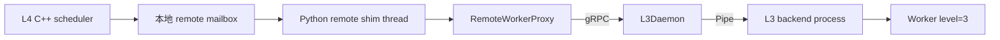

L4 C++ scheduler 不知道远端存在；它只看到一个普通 PROCESS-mode next-level mailbox。Python shim thread 负责把 mailbox 中的 task 转成远端 RPC。

### 1.2 控制面和数据面的边界

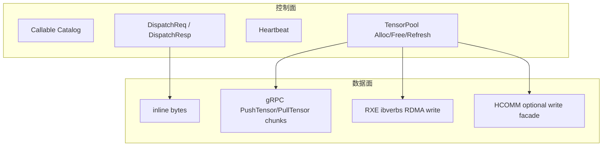

控制面只传元数据、handle、callable id、错误信息和生命周期操作。数据面负责 tensor bytes 的实际搬运。

## 2. 模块拆解

### 2.1 Worker remote child 接入

代码：

- `python/simpler/worker.py`
- `src/common/hierarchical/worker_manager.cpp`

关键入口：

- `Worker.add_remote_worker(endpoint, **options)`
- `Worker._ensure_distributed_catalog()`
- `Worker._init_hierarchical()`
- `Worker._start_hierarchical()`
- `_remote_worker_loop(buf, proxy)`

职责：

1. L4 用户调用 `add_remote_worker()` 注册远端 endpoint。
2. `Worker.init()` 时创建本地 shared-memory mailbox。
3. 创建 `RemoteWorkerProxy(endpoint, catalog, **options)`。
4. `_start_hierarchical()` 时先 `proxy.handshake()`，再启动 `_remote_worker_loop` thread。
5. 把 remote mailbox 注册给 C++ `_Worker.add_next_level_process(...)`。
6. C++ scheduler 发布 `TASK_READY` 后，remote shim thread 读取 mailbox，调用 `proxy.dispatch(...)`。
7. dispatch 成功或失败后，shim 写回 mailbox error 区和 `TASK_DONE`。

流程：

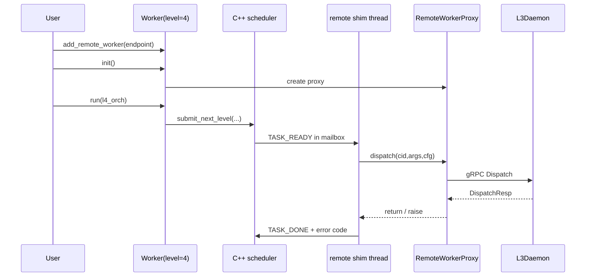

Review 关注点：

- `add_remote_worker()` 是否应该限制只能在 `level >= 4`、`init()` 前调用。
- remote mailbox 与本地 child worker mailbox 是否共享同一状态协议。
- `_remote_worker_loop()` 是否能正确传播异常到 mailbox error 区。
- remote proxy close 是否和 `_SHUTDOWN` 时序匹配。
- `worker_manager.cpp` 的 tensor tag 扩展是否保持旧 blob 格式兼容。

### 2.2 Callable Catalog

代码：

- `python/simpler/distributed/catalog.py`
- `python/simpler/worker.py`
- `python/simpler/distributed/l3_daemon.py`

职责：

- L4 侧把注册过的 callable 用 `cloudpickle` 序列化。
- callable id 保持和 L4 registry 一致。
- 版本号用 payload hash 表示，dispatch 时带上 `callable_version`。
- L3 daemon 和 backend process 都维护一份 catalog mirror。

流程：

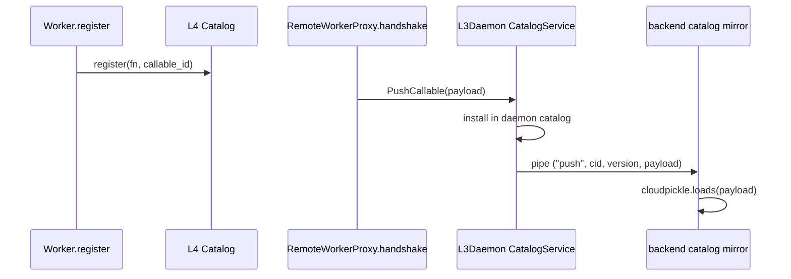

Review 关注点：

- `cloudpickle` 是受信任集群内机制，不能暴露给不可信客户端。
- callable closure 被序列化到 L3，远端修改的是反序列化副本，不会修改 L4 本地 Python 对象。
- version mismatch 时当前行为是 L3 lookup 失败并返回 error。

### 2.3 RPC/protobuf 控制协议

代码：

- `python/simpler/distributed/proto/dispatch.proto`
- `python/simpler/distributed/rpc.py`
- generated `dispatch_pb2*.py`

核心 service：

```protobuf
service L3Worker {
  rpc Dispatch(DispatchReq) returns (DispatchResp);
  rpc Heartbeat(Empty) returns (Health);
}

service Catalog {
  rpc PullCallable(CallableRef) returns (CallablePayload);
  rpc PushCallable(CallablePayload) returns (Empty);
}

service TensorPool {
  rpc AllocTensor(TensorAllocReq) returns (TensorHandle);
  rpc FreeTensor(TensorFreeReq) returns (Empty);
  rpc RefreshTensor(TensorRefreshReq) returns (TensorHandle);
  rpc PullTensor(TensorHandle) returns (stream TensorChunk);
  rpc PushTensor(stream TensorChunk) returns (TensorHandle);
}
```

重要消息：

- `DispatchReq.tensor_args`：旧地址式 tensor metadata，主要用于没有 tensor_refs 的兼容路径。
- `DispatchReq.tensor_refs`：当前分布式 tensor 数据面路径，小 tensor inline，大 tensor handle。
- `DispatchResp.output_tensors`：L3 output 回传，可能是 inline、L3 TensorPool handle，或 L4 local output ACK handle。
- `TensorHandle.transport`：`grpc` / `rxe` / `hcomm`。
- `TensorHandle.transport_desc`：transport 私有描述。

Review 关注点：

- protobuf 字段是否后向兼容。
- `tensor_args` 和 `tensor_refs` 同时存在时的语义是否明确。当前 L4 生成 tensor_refs 时会把 `tensor_args=[]`。
- `TensorHandle.node_id` 用于区分 L3 pool handle 和 L4 local output ACK。

### 2.4 L4 RemoteWorkerProxy

代码：

- `python/simpler/distributed/remote_proxy.py`

职责：

- 执行 heartbeat/catalog handshake。
- 把本地 `TaskArgs` staged 成 wire `TensorRef`。
- 分配/释放 L3 TensorPool handle。
- 对 input tensor 选择 gRPC/HCOMM/RXE push。
- 对 output tensor 选择 L4 local RXE writeback 或普通 PullTensor。
- 处理错误和资源释放。

关键函数：

- `handshake()`
- `dispatch()`
- `_stage_tensor_args()`
- `_stage_local_output_tensor()`
- `_push_remote_tensor_rxe()`
- `_push_remote_tensor_hcomm()`
- `_push_remote_tensor_grpc()`
- `_write_output_tensors()`
- `_free_remote_handles()`
- `_close_local_output_regions()`

#### 2.4.1 input tensor staging

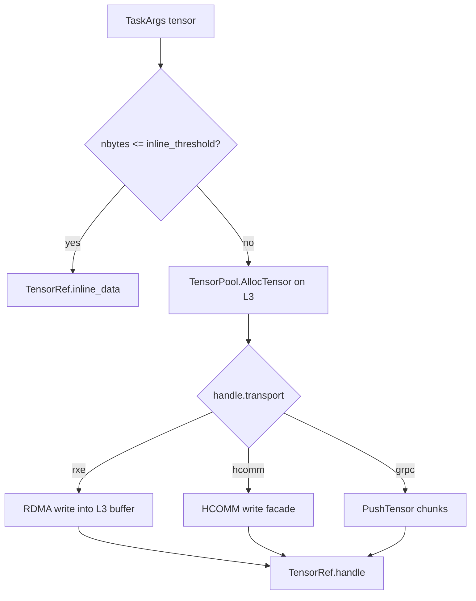

#### 2.4.2 output tensor staging

当前只有大 `OUTPUT / OUTPUT_EXISTING` 且 transport 是 `rxe` 或 `auto` 时，会走 L4 local RXE region：

```mermaid
flowchart TD
  A[OUTPUT/OUTPUT_EXISTING tensor] --> B{rxe/auto and large?}
  B -->|yes| C[L4 RxeRuntime.server_start(local output ptr)]
  C --> D[TensorRef.handle node_id=l4-rxe-*]
  B -->|no| E[普通 input-style staging / inline]
```

`INOUT` 没有走 local output RXE fast path。它仍然走 input staging，因为它需要把初始值发给 L3。

#### 2.4.3 dispatch 返回处理

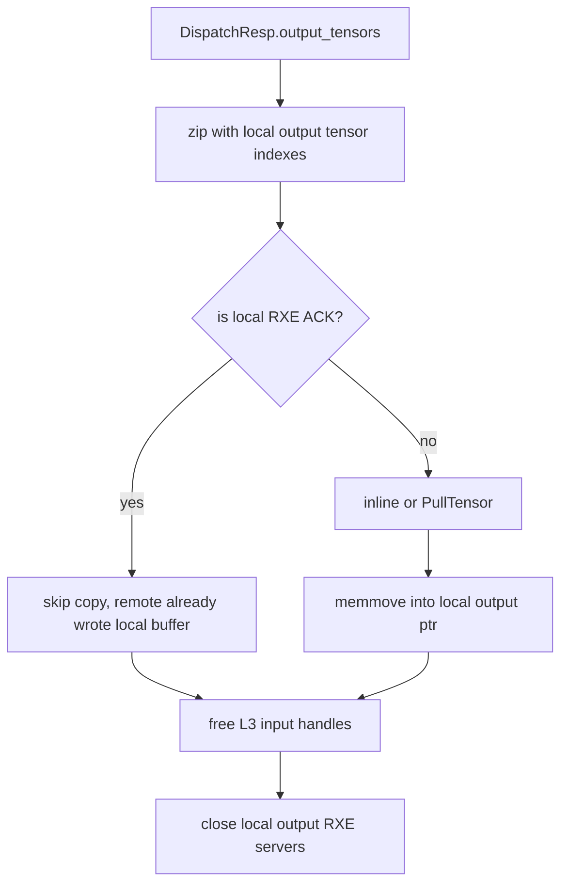

Review 关注点：

- `_stage_tensor_args()` 会对所有 large INPUT 分配远端 handle，并在异常时 best-effort free。
- local output RXE server lifetime 覆盖 dispatch 整个远端执行和写回。
- `auto` 模式下 RXE/HCOMM push 失败会回退 gRPC；显式 `rxe`/`hcomm` 失败会让远端不可用。
- `OUTPUT_EXISTING` 在当前设计中不会把旧值发送给 L3。如果用户依赖旧值，应使用 `INOUT`。
- `_write_output_tensors()` 依赖 output tensor 顺序与 L3 返回顺序一致。

### 2.5 L3Daemon 与 backend process

代码：

- `python/simpler/distributed/l3_daemon.py`

职责：

- 提供 gRPC service。
- 在 gRPC server 启动前 fork backend process。
- 通过 Pipe 把 Catalog/TensorPool/Dispatch 操作转发给 backend。
- backend process 拥有真实 `TensorPool` 和 `Worker(level=3)`。

进程结构：

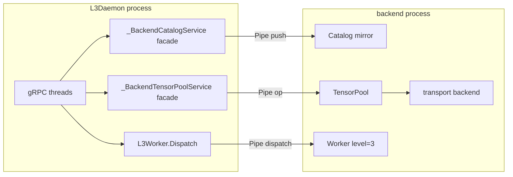

为什么需要 backend process：

- gRPC server 有线程。
- `Worker(level=3)` 内部还可能 fork sub/chip worker。
- 在有活跃 gRPC 线程的进程里 fork 风险较高。
- backend process 在 gRPC server 启动前创建，后续 Worker fork 发生在 backend 中。

#### 2.5.1 backend op

`_backend_loop()` 当前处理：

```text
stop
push
tensor_alloc
tensor_free
tensor_refresh
tensor_pull
tensor_push
dispatch
```

TensorPool gRPC facade 不直接持有 pool，只把请求 serialize 后通过 Pipe 发送给 backend。

#### 2.5.2 dispatch 执行策略

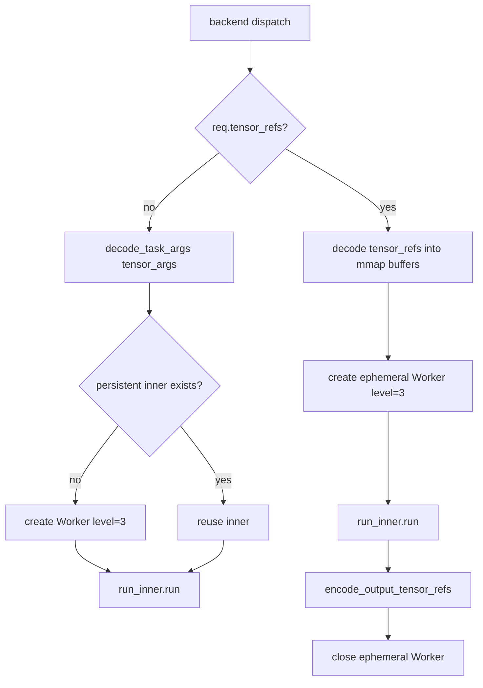

重点：有 tensor_refs 的 dispatch 使用 **ephemeral inner Worker**。原因是 tensor payload 被 materialize 到 backend process 的 mmap buffer，L3 sub/chip children 必须在这些 mmap 存在后 fork，才能继承同一映射。

Review 关注点：

- scalar-only dispatch 复用 persistent inner，提高普通控制面路径效率。
- tensor dispatch 每次创建/关闭 inner Worker，语义安全但性能较重。
- Pipe 同步调用由 `_backend_lock` 串行化，目前没有并发 dispatch 并行执行。
- backend 异常会被序列化为 `(False, traceback)`，daemon handler 转为 error resp 或 gRPC abort。

### 2.6 Tensor serialization

代码：

- `python/simpler/distributed/serialization.py`

职责：

- `CallConfig` encode/decode。
- 旧 `ContinuousTensorRef` decode。
- 新 `TensorRef` materialize。
- output tensor encode/writeback。

关键函数：

- `encode_task_args()`
- `decode_task_args()`
- `decode_task_args_with_tensor_refs_and_writebacks()`
- `encode_output_tensor_refs()`

#### 2.6.1 L3 materialize TensorRef

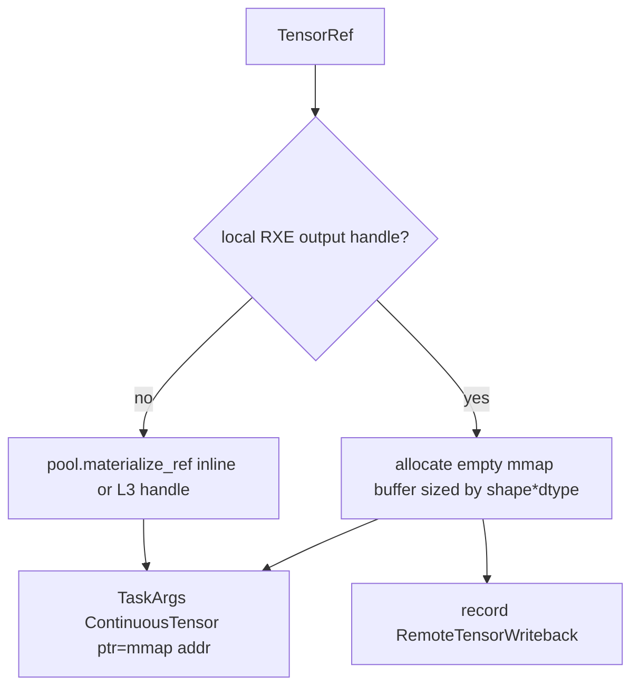

`RemoteTensorWriteback` 记录 tensor index 和 L4 output handle，供执行后写回。

#### 2.6.2 output encoding

```mermaid
flowchart TD
  A[TaskArgs output tensor] --> B{has writeback?}
  B -->|yes| C[try RxeDataPlaneClient.write_handle to L4]
  C -->|success| D[return ACK TensorRef(handle=L4 handle)]
  C -->|failure| E[fallback pool.put_bytes]
  B -->|no| E
  E --> F[inline or L3 TensorPool handle]
```

Review 关注点：

- `OUTPUT / OUTPUT_EXISTING` 可作为 remote output writeback。
- `INOUT` 当前不在 `_REMOTE_OUTPUT_TAGS`，避免丢初始输入值。
- RXE writeback 失败被吞掉并 fallback 到 pool path；这保证语义，但可能隐藏性能路径失败，后续可以加日志。
- `_shape_nbytes()` 依赖 `get_element_size(dtype)`。

### 2.7 TensorPool

代码：

- `python/simpler/distributed/tensor_pool.py`

职责：

- 管理 backend process 内的 bytearray storage。
- 提供 handle/lease/capacity/GC。
- 暴露 TensorPool gRPC servicer 形状。
- 调用 `TensorTransportBackend` 注册/注销 region。

核心对象：

```text
TensorPool._entries[handle_id] = _Entry(
  data=bytearray,
  nbytes,
  expires_at_ms,
  shape,
  dtype,
  tag,
  region=RegisteredRegion(...)
)
```

生命周期：

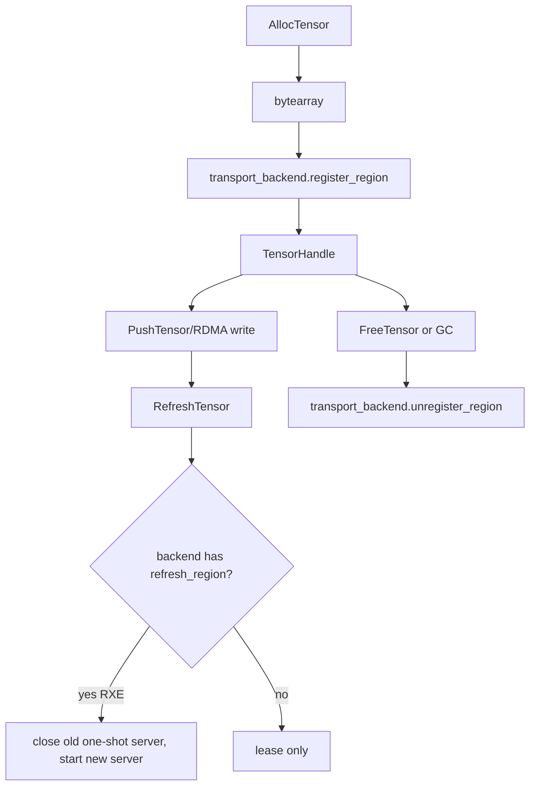

Review 关注点：

- capacity 与 lease 是否满足远端执行时间。
- `refresh_region()` 目前主要服务 RXE one-shot server 重建。
- `bytearray` 地址在 entry 生命周期内稳定；但 Python 对象生命周期必须由 `_Entry.data` 持有。
- gRPC `PushTensor` fallback 仍写同一个 pool buffer。

### 2.8 Transport backend

代码：

- `python/simpler/distributed/transport_backend.py`
- `python/simpler/distributed/rxe_verbs_helper.c`
- `python/simpler/distributed/hcomm_abi_shim.cc`

抽象：

```python
class TensorTransportBackend:
    def register_region(self, data: bytearray, *, tag: str) -> RegisteredRegion: ...
    def unregister_region(self, region: RegisteredRegion) -> None: ...
```

#### 2.8.1 gRPC backend

`GrpcTensorTransport` 只是返回本地 buffer 地址，实际传输走 `PushTensor/PullTensor`。

适合作为 fallback 和默认路径。

#### 2.8.2 RXE backend

Python 层：

- `RxeTensorTransport`
- `RxeRuntime`
- `RxeDataPlaneClient`

C 层：

- `simpler_rxe_server_start`
- `simpler_rxe_server_stop`
- `simpler_rxe_write`

RXE input 流程：

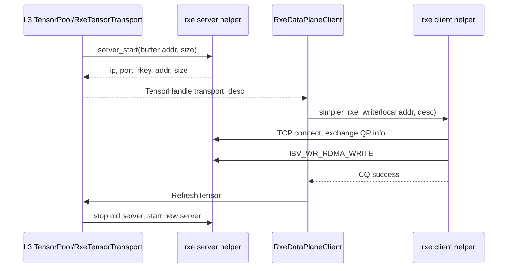

RXE desc v2：

```text
magic="SRXE"
version=2
header_size
port
gid_index
rkey
addr
size
ip[64]
device[64]
```

Review 关注点：

- C helper 是 MVP：每个 region/write 还是临时 QP/TCP 控制连接，不是连接池。
- `server_stop()` 会 shutdown listen fd 和 accepted fd，避免失败路径挂住。
- `_build_rxe_verbs_helper()` 动态编译 C helper 到 `.cache`，依赖本机 rdma-core include/lib。
- desc parser 兼容旧 JSON desc。

#### 2.8.3 HCOMM backend

HCOMM 只做 Simpler 侧适配：

- 不修改 `3rd/hcomm` 源码。
- `HcommRuntime` 加载 `libhcomm.so` 和 CANN/HCOMM 依赖。
- `hcomm_abi_shim.cc` 只补 stock HCOMM 本地 build 可能缺的 ABI 符号。
- CPU RoCE channel E2E 在当前 910B1 host 环境不是主路径。

Review 关注点：

- HCOMM explicit 模式失败应清晰报错。
- `auto` 默认不会因为 HCOMM/RXE 不可用而破坏 gRPC。
- HCOMM source tree 不应被本项目提交依赖修改。

## 3. 端到端流程详解

### 3.1 初始化流程

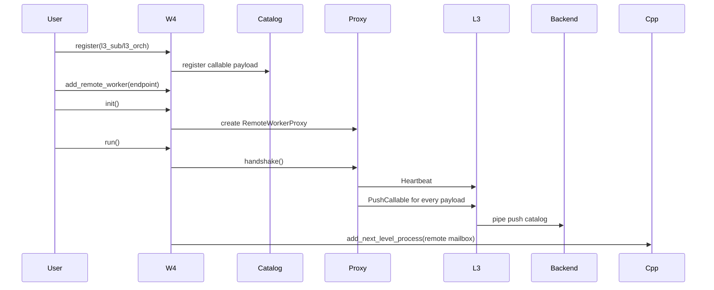

### 3.2 scalar-only dispatch

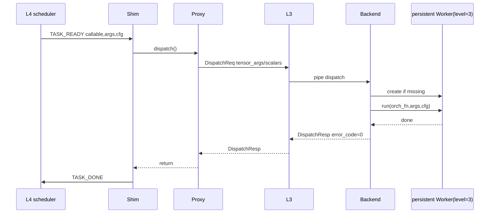

### 3.3 large input with RXE

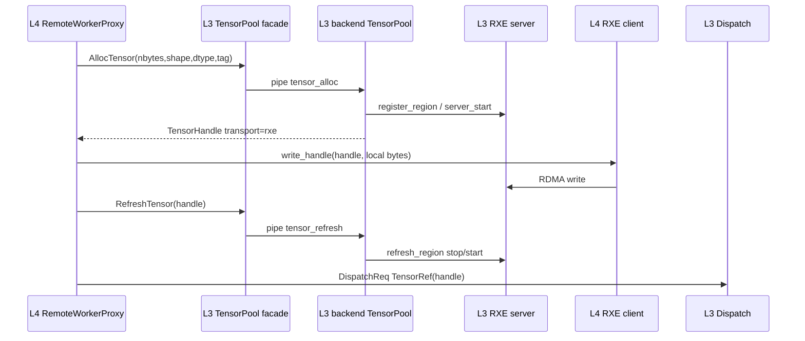

### 3.4 large output with RXE writeback

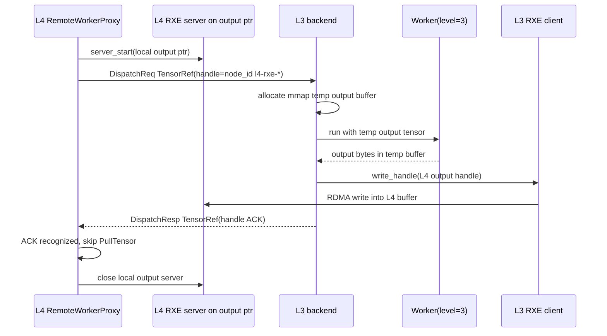

Fallback：

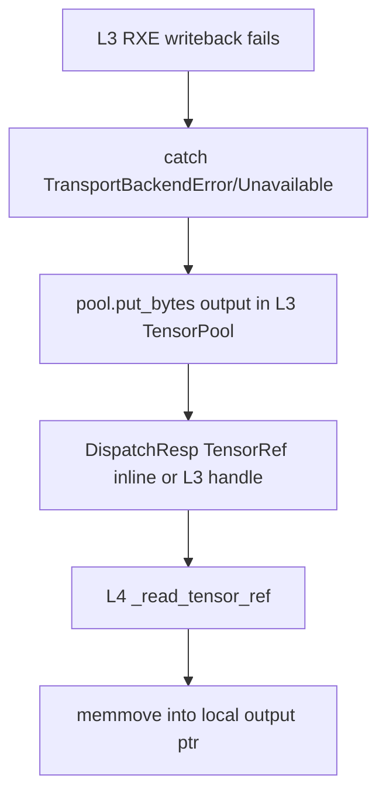

## 4. Error handling and lifecycle

### 4.1 remote unavailable

- heartbeat RPC 失败：`RemoteUnavailable`。
- dispatch RPC 失败：mark proxy unavailable，free already allocated remote handles。
- remote response `error_code != 0`：free remote handles and close local output regions, raise `RuntimeError` with remote traceback.

### 4.2 tensor handle cleanup

L4 owns two kinds of temporary resources:

```text
remote_handles:
  L3 TensorPool allocated handles for large input or fallback output.
  cleanup: TensorPool.FreeTensor best-effort.

local_output_regions:
  L4 RXE servers opened on local output buffer.
  cleanup: RxeRuntime.server_stop best-effort.
```

L3 backend owns:

```text
TensorPool entries:
  freed by FreeTensor, GC, or TensorPool.close().

ephemeral Worker for tensor dispatch:
  closed in finally.

mmap keepalive buffers:
  kept alive until run and output encoding finish, then cleared.
```

### 4.3 fallback policy

```text
L4 -> L3 input:
  explicit rxe/hcomm failure: error
  auto mode rxe/hcomm failure: fallback to gRPC PushTensor

L3 -> L4 output:
  RXE writeback failure: fallback to L3 TensorPool / gRPC output response
```

Review 关注点：

- fallback 是否应该记录 warning/log。当前 output fallback 是静默的。
- explicit `rxe` input 失败不 fallback，这是为了避免用户以为走了真实 RDMA。
- cleanup 是 best-effort，失败不会覆盖原始 dispatch 错误。

## 5. 当前测试覆盖

主要测试：

```text
tests/ut/py/test_distributed/test_l4_l3_remote.py
  - scalar remote dispatch
  - inline tensor input
  - large handle tensor input
  - output tensor writeback
  - INOUT writeback
  - sub-worker tensor path
  - heartbeat behavior

tests/ut/py/test_distributed/test_tensor_pool.py
  - TensorPool alloc/free/refresh
  - inline/handle encode/decode
  - output TensorRef encode

tests/ut/py/test_distributed/test_transport_backend.py
  - HCOMM struct layout
  - RXE desc v2 roundtrip
  - RXE legacy JSON desc compatibility

tests/ut/py/test_distributed/test_real_e2e_smoke.py
  - real L4/L3 TensorPool handle E2E
  - real RXE ibverbs smoke
  - real L4/L3 RXE transport E2E
  - HCOMM endpoint/mem export smoke

tests/ut/py/test_distributed/test_rxe_real.py
  - ibv_rc_pingpong smoke
```

脚本：

```bash
tools/test_rxe_data_plane.sh
```

当前已验证结果：

```text
38 passed, 3 skipped
1 passed
2 passed, 2 deselected
RXE data-plane tests passed.
```

Benchmark：

```bash
PYTHONPATH=python tools/benchmark_rxe_data_plane.py \
  --sizes 8192,65536,1048576 \
  --repeats 10 \
  --warmup 2 \
  --transports grpc,rxe
```

## 6. 已知局限

1. **RXE helper 不是连接池**

   当前是 TCP 控制连接 + RC QP + MR 的 MVP，每个 region/write 成本较高。`RefreshTensor` 重建 server 解决可用性，不解决性能上限。

2. **tensor dispatch 使用 ephemeral inner Worker**

   这是为了让 sub/chip child fork 后继承 mmap tensor storage。语义安全，但性能重。要复用 persistent L3 worker，需要更强的跨进程 tensor 注入机制。

3. **INOUT 未做完整双向 RXE fast path**

   `INOUT` 需要先传初始值到 L3，再把结果写回 L4。当前走 input staging + response output 路径，不走 local output RXE ACK。

4. **Pipe backend 串行化**

   `_backend_lock` 让 L3 daemon 到 backend 的操作串行执行。当前简单可靠，但限制并发。

5. **Catalog 是受信任执行模型**

   `cloudpickle` payload 是可执行代码反序列化，只能用于受信任集群。

6. **output RXE fallback 静默**

   L3->L4 output RXE writeback 失败时会 fallback 到 TensorPool response，功能正确但不容易发现性能路径失效。

7. **跨节点和多并发覆盖不足**

   当前实机验证主要是单机 RXE。跨 host RoCE、多 remote worker、多并发 dispatch、长时间压测还需要补。

8. **HCOMM 不是当前主路径**

   HCOMM adapter 可加载 endpoint/mem，CPU RoCE channel E2E 在当前 910B1 host 环境不是主验证路径。

## 7. Review Checklist

### 控制面

- `Worker.add_remote_worker()` 的 API 语义是否和 `add_worker()` 一致。
- remote mailbox shim 是否正确模拟 PROCESS child worker。
- remote worker thread 与 C++ scheduler 的状态机是否有 race。
- heartbeat 失败后 `_available` 的语义是否符合调度期望。
- Catalog version/hash 是否足以避免 stale callable。

### 数据面

- inline threshold 的默认值和配置入口是否合理。
- L4 input staging 是否会错误读取 OUTPUT-only tensor 的旧值。
- `OUTPUT_EXISTING` 不发送旧值、`INOUT` 发送旧值的语义是否清晰。
- L3 output 顺序与 L4 output tensor index zip 是否可靠。
- TensorPool lease/GC 是否可能在长任务中提前释放 handle。

### RXE

- RXE desc v2 字段是否足够支持跨 host。
- RXE helper 的 direct struct/TCP control protocol 是否可接受为 MVP。
- `server_stop()` 在 client failure、timeout、FreeTensor 时是否不会 hang。
- refresh 重建 server 是否有重复写/并发写 race。
- 显式 `rxe` 失败是否应该 fallback，还是继续 fail-fast。

### L3 backend

- 有 tensor_refs 时创建 ephemeral Worker 的成本是否可接受。
- backend Pipe 串行是否满足当前需求。
- backend exception 到 `DispatchResp.remote_traceback` 的传播是否足够。
- TensorPool facade 把所有操作转发 backend 是否有死锁风险。

### 测试

- 是否需要把 example 加入自动测试。
- 是否需要新增多 remote worker 分发测试。
- 是否需要新增 RXE output fallback 强制失败测试。
- 是否需要跨 host RoCE smoke。
- 是否需要 benchmark 阈值或只保留观测输出。

## 8. 建议 reviewer 先看的文件顺序

1. `python/simpler/worker.py`

   先看 `add_remote_worker()`、`_remote_worker_loop()`、`_init_hierarchical()`、`_start_hierarchical()`，理解 remote worker 如何伪装成本地 PROCESS child。

2. `python/simpler/distributed/proto/dispatch.proto`

   看清楚 `DispatchReq`、`DispatchResp`、`TensorHandle`、`TensorRef`。

3. `python/simpler/distributed/remote_proxy.py`

   这是 L4 侧最核心逻辑，重点看 `_stage_tensor_args()`、`_push_remote_tensor_*()`、`_write_output_tensors()`。

4. `python/simpler/distributed/l3_daemon.py`

   看 daemon/backend process 分离、backend op、`_backend_dispatch()`。

5. `python/simpler/distributed/serialization.py`

   看 TensorRef 到 mmap buffer 的 materialize，以及 output writeback/fallback。

6. `python/simpler/distributed/tensor_pool.py`

   看 handle 生命周期和 refresh hook。

7. `python/simpler/distributed/transport_backend.py`

   看 RXE/HCOMM/gRPC backend 边界和 `build_tensor_transport()` 策略。

8. `python/simpler/distributed/rxe_verbs_helper.c`

   最后看真实 ibverbs MVP 是否符合你对数据面的预期。
