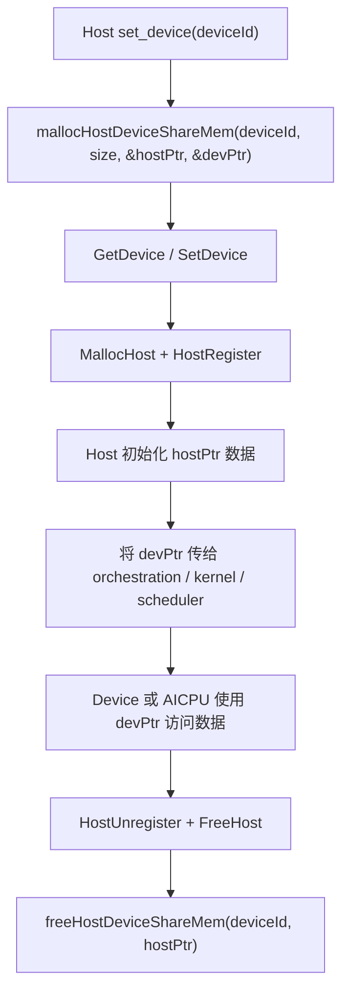

# Host-Device 共享内存接口说明

本文档说明本次新增的两个最小接口：

```cpp
int mallocHostDeviceShareMem(
    uint32_t deviceId,
    uint64_t size,
    void **hostPtr,
    void **devPtr
);

int freeHostDeviceShareMem(
    uint32_t deviceId,
    void *hostPtr
);
```

这两个接口的目标很简单：
- `mallocHostDeviceShareMem`：在 Host 侧申请一段内存，并将其注册成 Device 可访问地址
- `freeHostDeviceShareMem`：注销这段映射内存，并释放 Host 内存

当前真机实现位于：
- [src/a2a3/platform/onboard/host/pto_runtime_c_api.cpp](/D:/PTO/code/simpler-PTO-wangchao-main/src/a2a3/platform/onboard/host/pto_runtime_c_api.cpp:365)
- [src/a2a3/platform/onboard/host/pto_runtime_c_api.cpp](/D:/PTO/code/simpler-PTO-wangchao-main/src/a2a3/platform/onboard/host/pto_runtime_c_api.cpp:444)

## 1. 接口定义

### `mallocHostDeviceShareMem`

功能：
- 为指定 `deviceId` 准备一块 Host-Device 共享访问的映射内存
- 返回 Host 可直接读写的 `hostPtr`
- 返回 Device 可访问的 `devPtr`

内部执行顺序：
1. 先调用 `aclrtGetDevice` / `rtGetDevice` 查询当前线程是否已经绑定 device
2. 如果查询失败，认为当前线程还没有 `set_device`，内部会继续尝试 `rtSetDevice(deviceId)` / `aclrtSetDevice(deviceId)`
3. 如果查询成功，但当前 device 和输入 `deviceId` 不一致，则直接报错
4. device 检查通过后，调用 `rtMallocHost`，找不到时回退到 `aclrtMallocHost`
5. Host 内存申请成功后，调用 `rtsHostRegister` / `rtHostRegister`，找不到时回退到 `aclrtHostRegister`
6. 注册成功后返回 `hostPtr` 和 `devPtr`
7. 如果注册失败，接口内部会负责回收刚申请的 Host 内存，避免泄漏

一句话理解就是：

```text
GetDevice / SetDevice -> MallocHost -> HostRegister
```

输入输出：

| 参数 | 方向 | 说明 |
| ---- | ---- | ---- |
| `deviceId` | 输入 | 目标设备号 |
| `size` | 输入 | 申请字节数 |
| `hostPtr` | 输出 | Host 侧地址 |
| `devPtr` | 输出 | Device 侧可访问地址 |
| 返回值 | 输出 | `0` 成功，非 `0` 失败 |

调用后可得到：
- `hostPtr`：Host 可以直接读写
- `devPtr`：后续可传给 orchestration、kernel，或后续扩展给 AICPU scheduler 使用

### `freeHostDeviceShareMem`

功能：
- 释放之前通过 `mallocHostDeviceShareMem` 创建的共享映射内存

内部执行顺序：
1. 先调用 `aclrtGetDevice` / `rtGetDevice` 查询当前线程是否已经绑定 device
2. 如果查询失败，认为当前线程还没有 `set_device`，内部会继续尝试 `rtSetDevice(deviceId)` / `aclrtSetDevice(deviceId)`
3. 如果查询成功，但当前 device 和输入 `deviceId` 不一致，则直接报错
4. device 检查通过后，调用 `rtsHostUnregister` / `rtHostUnregister`，找不到时回退到 `aclrtHostUnregister`
5. 注销成功后，调用 `rtFreeHost`，找不到时回退到 `aclrtFreeHost`
6. 完成释放

一句话理解就是：

```text
GetDevice / SetDevice -> HostUnregister -> FreeHost
```

输入输出：

| 参数 | 方向 | 说明 |
| ---- | ---- | ---- |
| `deviceId` | 输入 | 目标设备号 |
| `hostPtr` | 输入 | 之前申请得到的 Host 地址 |
| 返回值 | 输出 | `0` 成功，非 `0` 失败 |

## 2. 调用方式

推荐调用顺序：

1. `set_device(deviceId)`
2. `mallocHostDeviceShareMem(deviceId, size, &hostPtr, &devPtr)`
3. Host 通过 `hostPtr` 初始化数据
4. 将 `devPtr` 传给后续执行链路
5. 使用结束后调用 `freeHostDeviceShareMem(deviceId, hostPtr)`

说明：
- 接口内部已经带了 device 检查和必要时的 `set_device` 补偿逻辑
- 但从使用习惯上，仍然建议外部先显式 `set_device(deviceId)`，这样语义最清晰
- 这两个接口是独立实现
- 内部不会再中转调用旧的 `host_malloc` / `host_register_mapped`
- `a2a3sim`、`a5`、`a5sim` 当前返回 unsupported

## 3. Python 侧封装

Python 侧提供了两组可直接调用的入口：

```python
malloc_host_device_share_mem(size, device_id=None)
free_host_device_share_mem(host_ptr, device_id=None)
```

兼容别名：

```python
mallocHostDeviceShareMem(device_id, size)
freeHostDeviceShareMem(device_id, host_ptr)
```

主要封装位置：
- [python/simpler/task_interface.py](/D:/PTO/code/simpler-PTO-wangchao-main/python/simpler/task_interface.py:234)
- [python/bindings/task_interface.cpp](/D:/PTO/code/simpler-PTO-wangchao-main/python/bindings/task_interface.cpp:608)
- [src/common/worker/chip_worker.cpp](/D:/PTO/code/simpler-PTO-wangchao-main/src/common/worker/chip_worker.cpp:236)

调用链如下：

```text
golden.py
-> simpler.task_interface.malloc_host_device_share_mem(...)
-> active ChipWorker
-> _impl.malloc_host_device_share_mem(...)
-> nanobind
-> ChipWorker::mallocHostDeviceShareMem(...)
-> host runtime 导出符号 mallocHostDeviceShareMem(...)
-> pto_runtime_c_api.cpp 中的真机实现
```

## 4. Demo 示例

当前 demo 位于：
- [examples/a2a3/tensormap_and_ringbuffer/host_register_mapped_demo/golden.py](/D:/PTO/code/simpler-PTO-wangchao-main/examples/a2a3/tensormap_and_ringbuffer/host_register_mapped_demo/golden.py:1)

最小示例：

```python
import ctypes
import numpy as np

from simpler.task_interface import (
    free_host_device_share_mem,
    malloc_host_device_share_mem,
)

size = 128 * 128 * ctypes.sizeof(ctypes.c_float)

host_ptr, dev_ptr = malloc_host_device_share_mem(size)

host_buf = (ctypes.c_float * (128 * 128)).from_address(host_ptr)
host_np = np.ctypeslib.as_array(host_buf)
host_np[:] = np.arange(host_np.size, dtype=np.float32)

# 后续将 dev_ptr 传给 orchestration / kernel / runtime

free_host_device_share_mem(host_ptr)
```

在当前 `host_register_mapped_demo` 里：
- Host 先通过 `hostPtr` 初始化 `0, 1, 2, ...`
- `devPtr` 作为标量参数传入 orchestration
- kernel 读取 `devPtr` 对应地址，执行 `+1`
- demo 同时打印：
  - 初始 Host 数据
  - 执行后 Host 内存数据
  - 普通 output copy-back 的结果

## 5. AICPU Scheduler 后续使用建议

如果后续希望在 AICPU scheduler 里直接访问这块内存，建议按下面方式使用：

1. Host 侧先调用 `mallocHostDeviceShareMem`，拿到 `hostPtr` 和 `devPtr`
2. 在运行前把 `devPtr` 传入 runtime / orchestration / scheduler 可见的位置
3. scheduler 内部只把这块地址当作“外部映射地址”来访问，不负责申请和释放
4. 生命周期仍由 Host 控制，结束后统一调用 `freeHostDeviceShareMem`

简洁建议：
- scheduler 侧只消费 `devPtr`
- Host 侧负责创建、初始化、释放
- 不要在 scheduler 里重复做 `MallocHost` / `HostRegister`
- 如果后续存在 Host 与 scheduler 并发修改，需要额外补 flag 或 ownership 协议

可以把它理解成一条简单边界：
- Host 负责资源管理
- AICPU scheduler 负责使用地址

## 6. 简单流程图


