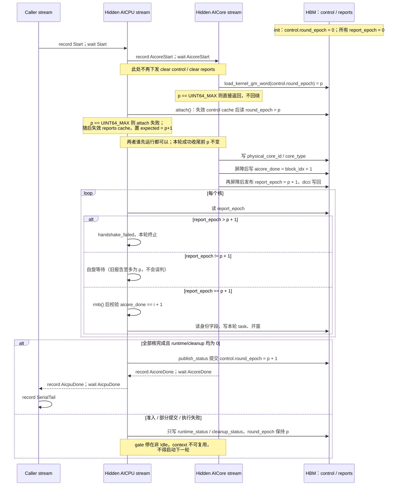

# TMR kernel 模式的逐轮报告与清零开销

本文记录 kernel 模式报告区的轮次协议、零清零方案及验收边界。
这是实现与测试的设计契约；未通过真机验证前，不把“少两个 RTS task”等同于性能提升或协议完成。

当前分支以 `hw-native-sys/simpler` 的 `feat/kernel-mode-integration-test` `dd32e1cc` 为基线。
Host/sim UT 覆盖成功轮次累进、失败不推进及延迟旧报告；A2/A3 onboard capture 矩阵现为 33/33
通过，其中包含定向延迟 AICore 报告（AICore 被 gate 阻塞时直接确认旧 report 仍是 epoch 1，释放后
第二轮推进到 epoch 2）、eager/capture 提交范围内零 memset 断言及成功轮之后故障不推进 epoch
的观察。A5 对应测试代码已提供，observer 的 A5 编译和用例收集通过，但没有 A5
silicon，故不报告为 onboard 通过。

Program 模式 A2/A3 回归已完成：`available_aicore_counts`、`spmd_multiblock_mix`、
`spmd_sync_start_mix_spill`、`sync_start_early_local_owner`、`spmd_sync_start_edge` 与
`dummy_task` 全部通过，并另以 `SIMPLER_TMR_SERIAL_ORCH_SCHED_ENABLE=1` 重跑一次覆盖
`handshake_partition` 分支（现有 program ST 默认只走 `handshake_owned_clusters`）。A5 无硅片，未验证。

性能方面，已实测 `aclrtMemsetAsync` 提交次数由上游基线的每次 launch 2 次降为 0 次；
eager/replay 的 p50/p99 与 capture 图节点数仍未测量。**不能由 task 数减少推定实际加速** ——
零 memset 版本让每个 AICore 多读一条共享 control cache line，净收益必须实测。

## 现有执行顺序与问题

同一 context 的一轮 launch 保持以下流和事件顺序：

```text
caller       record Start ────────────────────────────────────────────────┐
hidden AICPU wait Start → clear control → clear reports → record AicoreStart
              → launch AICPU exec → wait AicoreDone → record AicpuDone
hidden AICore                         wait AicoreStart → launch AICore
                                      → record AicoreDone
caller       wait AicpuDone → record SerialTail
```

两次 `aclrtMemsetAsync` 分别清理常驻的 64 字节 `TmrLaunchControl` 和逐核 `TmrCoreReport`。
report 清零具有当前协议所需的作用：AICore 每轮令 `aicore_done` 非零，AICPU 以非零作为本轮身份报告就绪的条件；不清理时，旧报告可能让 AICPU 在本轮 AICore 发布身份前使用旧物理核编号开窗。
control 的原有结果检查 task 已移除；当前生产路径写状态，但不消费其 `completion`。不能为了删除 control 而不加区分地删除 reports 清零。

Program 模式在 Host 启动前将其 Runtime 内嵌报告的 `aicore_done` 置零。
它的 TensorMap epoch 解决内部桶/slot 懒清，不是核启动身份报告协议。
Kernel 的 ACLGraph replay 不再运行 Host 启动代码，故不能照搬 Host 置零。

## 目标协议

在不增添 task、不改变 `Start → AicoreStart → AICore/AICPU → AicoreDone → AicpuDone → SerialTail` 事件拓扑的前提下，用设备侧轮次编号代替两次清零。

`control.round_epoch` 定义为**该 context 上一次完整成功轮次的编号**，与 AICPU 进程内 `KernelRoundGate` 的 ticket epoch 不同。
init 时常驻协调块整体初始化为零。每一轮按以下规则执行：

1. AICore 和 AICPU leader 各自读取同一 `control.round_epoch = p`，本轮预期编号为 `p + 1`。读取前必须满足对应设备缓存新鲜度要求。
2. 每个 AICore 先写物理核 ID、核类型等身份字段，最后发布自己报告的 `report_epoch = p + 1` 并写回该报告 cache line。
3. AICPU 仅在 `report_epoch == p + 1` 时接受该核的本轮身份；匹配后执行读屏障，再使用身份、写 task 并开窗。旧的 `aicore_done != 0` 不能独自作为就绪条件。
4. 所有核完成且本轮成功收尾后，唯一 finalizer 才提交 `control.round_epoch = p + 1`。失败路径可记录错误状态，但**不得推进该字段**，并必须禁止同一 context 再次执行。

一轮的完整时序如下。事件边（`Start` / `AicoreStart` / `AicoreDone` / `AicpuDone` / `SerialTail`）与改动前逐条相同，
差别只在于原先夹在 `wait Start` 和 `record AicoreStart` 之间的两次 `aclrtMemsetAsync` 不再下发。



健康轮次的不变量是：开始时 control 的值为 `p`，所有旧 report 的 epoch 至多为 `p`；所以旧报告不能满足本轮所需的 `p + 1`。成功收尾后 control 成为 `p + 1`，形成下一轮的起点。
即使 AICore task 先于 AICPU task 入队，两者实际启动先后不确定也不影响该不变量：成功 finalizer 必须等待所有核的本轮身份报告，因此不会在某个尚未读取 control 的正常 AICore 之前提交新 epoch。

失败路径是协议的一部分。finalizer 可发布错误状态，但仅当 runtime 与 cleanup 均成功时才写入 `control.round_epoch`。失败轮次保留 gate 和借用参数，禁止同一 context 重试；超时或失败本身不能证明迟到的 AICore 已停止访问资源。

`report_epoch` 已由 AICore 在发布身份后写入，并由 TMR scheduler 用精确的 `p + 1` 匹配后再读取身份字段。AICore、AICPU 与共享 scheduler 的改动仅对 kernel 模式启用；program 的 Host 置零和非零报告判断保持原行为。不能把持续跨 context 的 `KernelRoundGate` ticket 直接写作新 context 的首轮编号。

## 生命周期与并发硬边界

- 一份协调块由一个 context 持有；新 context 的 control/reports 从零开始。旧图仍引用旧协调块时不得释放或复用它。
- 同一 context 的设备轮次必须严格串行。Host 的 launch 提交锁只保护入队；ACLGraph replay 不重新进入这个锁。不同图或 caller stream 的 replay 需要外部图级串行保证，不能把 Host 锁视作该保证。
- 部分提交、准入失败、AICore 缺席、执行失败或缓存可见性错误后，不得启动下一轮；先将 context/owner 标为不可复用。终止流程不通过重清零来掩盖失败。
- control 是上轮成功编号的单一权威；reports 是逐核本轮发布。64 位编号回绕必须 fail-closed，不允许旧编号再次被接受。
- AICore 对身份与 epoch 的发布顺序、AICPU 匹配后的读屏障、两侧跨轮缓存失效必须在 A2/A3 与 A5 上分别核实。Host-only UT 或 simulator 不能证明真机缓存语义。

## 验收与性能比较

正确性测试至少包括：

1. 连续 eager、多次单图 replay、两图交替 replay、eager/replay 混用；同一 context 连续轮次的编号单调，旧 report 不被接受。
2. 不同 caller stream **串行**提交与回放；对重叠回放明确拒绝或由调用方保证不发生，不把 Host 提交锁的覆盖范围夸大到 replay。
3. 延迟 AICore 身份发布；AICPU 必须等到本轮 report，而不能凭上轮非零 `aicore_done` 开窗。
4. Host 部分 enqueue 失败、设备准入失败、缺核及执行失败：epoch 不错误推进，后续同 context 调用被拒；旧可用资源不因失败释放过早。
5. 新 context 和新 generation 从零重新开始；验证旧图与新 context 的资源隔离。覆盖 A2/A3 和 A5 的 onboard 路径及 program 回归。

同一 context 的 eager Host 提交由提交锁串行化；ACLGraph replay 不进入该锁。跨 caller stream 或跨图 replay 必须由调用方串行提交。本 runtime 不承诺阻止外部并发 replay，也不应以并发 replay 成功用例描述受支持行为。

A2/A3 ST 直接断言每个 eager launch 和 graph capture 的提交范围内没有 `aclrtMemsetAsync`；真实设备 gate 延迟 AICore 报告发布，并使用不同的第二轮标量确认第二轮确实执行；故障用例分别验证首轮失败保持 epoch=0、成功一轮后的失败保持 epoch=1。A5 对应测试代码与 A2/A3 共用用例逻辑，observer 对 A5 头文件完成编译、两项用例完成 collection，但未运行硬件时必须标记未验证。

性能以“仅保留一次 reports memset”的正确实现为基线，再与零 memset 版本比较 capture 节点数及 eager/replay 的 p50、p99。
零 memset 版本使每个 AICore 多读同一 control cache line；少一个 RTS task 不保证整体更快。若共享 control 读取成为热点，可另行评估每核自增旧 `report_epoch`，但它依赖每核每轮完整参与，不能在没有故障重同步证明时替换首版协议。
