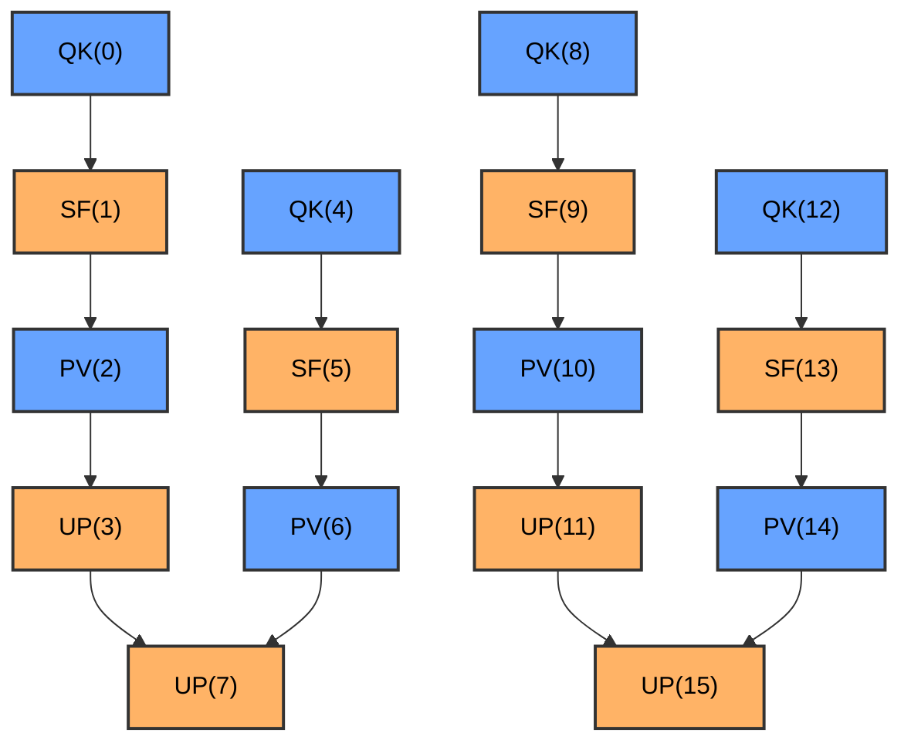

# Swimlane Performance Analysis Tools

This directory contains performance analysis tools for PTO Runtime.

## Tools

- **[swimlane_converter.py](#swimlane_converterpy)** — Convert to Chrome Trace Event format for visualization
- **[perf_to_mermaid.py](#perf_to_mermaidpy)** — Convert to Mermaid dependency graph

---

## swimlane_converter.py

Converts performance profiling JSON data to Chrome Trace Event format for visualization in Perfetto.

### Overview

`swimlane_converter.py` converts PTO Runtime profiling data (`perf_swimlane_*.json`) into a format viewable in the Perfetto trace viewer (https://ui.perfetto.dev/). It also provides per-function task execution statistics.

### Basic Usage

```bash
# Auto-detect the latest profiling file in outputs/
python3 tools/swimlane_converter.py

# Specify input file
python3 tools/swimlane_converter.py outputs/perf_swimlane_20260210_143526.json

# Specify output file
python3 tools/swimlane_converter.py outputs/perf_swimlane_20260210_143526.json -o custom_output.json

# Load function name mapping from kernel_config.py
python3 tools/swimlane_converter.py outputs/perf_swimlane_20260210_143526.json \
    -k examples/host_build_graph/paged_attention/kernels/kernel_config.py

# Verbose mode (for debugging)
python3 tools/swimlane_converter.py outputs/perf_swimlane_20260210_143526.json -v
```

### Command-Line Options

| Option | Short | Description |
|--------|-------|-------------|
| `input` | | Input JSON file (`perf_swimlane_*.json`). If omitted, uses the latest file in `outputs/` |
| `--output` | `-o` | Output JSON file (default: `outputs/merged_swimlane_<timestamp>.json`) |
| `--kernel-config` | `-k` | Path to `kernel_config.py` for function name mapping |
| `--verbose` | `-v` | Enable verbose output |

### Output

The tool produces two types of output:

#### 1. Perfetto JSON File

A Chrome Trace Event format JSON file viewable in Perfetto:
- File location: `outputs/merged_swimlane_<timestamp>.json`
- Open https://ui.perfetto.dev/ and drag the file in to visualize

#### 2. Task Statistics

Per-function grouped statistics summary (printed to console):

```
========================================================================================================
Task Statistics by Function
========================================================================================================
Func ID  Func Name                Count    Total (us)     Avg (us)     Min (us)     Max (us)
--------------------------------------------------------------------------------------------------------
0        QK                          10       1502.50       150.25       120.50       180.30
1        SF                          10       2001.00       200.10       180.20       220.50
2        PV                          10       1758.00       175.80       160.00       190.40
3        UP                          10       1005.00       100.50        90.10       110.20
--------------------------------------------------------------------------------------------------------
TOTAL                                40       6266.50
========================================================================================================
```

Statistics include:
- **Func ID**: Function identifier from kernel config
- **Func Name**: Function name (from `kernel_config.py` or auto-generated)
- **Count**: Number of tasks for this function
- **Total (us)**: Total execution time across all tasks (microseconds)
- **Avg (us)**: Average execution time per task (microseconds)
- **Min (us)**: Minimum execution time (microseconds)
- **Max (us)**: Maximum execution time (microseconds)

### Integration with run_example.py

When running tests with profiling enabled, the converter is called automatically:

```bash
# Run test with profiling — merged_swimlane.json is generated automatically after pass
python examples/scripts/run_example.py \
    -k examples/host_build_graph/vector_example/kernels \
    -g examples/host_build_graph/vector_example/golden.py \
    --enable-profiling
```

After the test passes, the tool will:
1. Auto-detect the latest `perf_swimlane_*.json` in `outputs/`
2. Load function names from the `-k` kernel_config.py
3. Generate `merged_swimlane_*.json` for visualization
4. Print task statistics to the console

---

## perf_to_mermaid.py

Converts performance profiling data to Mermaid flowchart format for visualizing task dependencies.

### Overview

`perf_to_mermaid.py` converts PTO Runtime profiling data (`perf_swimlane_*.json`) into Mermaid flowchart format. The generated Markdown file can be:
- Rendered directly in GitHub/GitLab
- Viewed at https://mermaid.live/
- Viewed in editors with Mermaid support (e.g., VS Code + Mermaid extension)

### Basic Usage

```bash
# Auto-detect the latest profiling file in outputs/
python3 tools/perf_to_mermaid.py

# Specify input file
python3 tools/perf_to_mermaid.py outputs/perf_swimlane_20260210_143526.json

# Specify output file
python3 tools/perf_to_mermaid.py outputs/perf_swimlane_20260210_143526.json -o diagram.md

# Load function name mapping from kernel_config.py
python3 tools/perf_to_mermaid.py outputs/perf_swimlane_20260210_143526.json \
    -k examples/host_build_graph/paged_attention/kernels/kernel_config.py

# Use compact style (task ID and function name only)
python3 tools/perf_to_mermaid.py outputs/perf_swimlane_20260210_143526.json --style compact

# Verbose mode
python3 tools/perf_to_mermaid.py outputs/perf_swimlane_20260210_143526.json -v
```

### Command-Line Options

| Option | Short | Description |
|--------|-------|-------------|
| `input` | | Input JSON file (`perf_swimlane_*.json`). If omitted, uses the latest file in `outputs/` |
| `--output` | `-o` | Output Markdown file (default: `outputs/mermaid_diagram_<timestamp>.md`) |
| `--kernel-config` | `-k` | Path to `kernel_config.py` for function name mapping |
| `--style` | | Node style: `detailed` (with core type and timing) or `compact` (function name only) |
| `--verbose` | `-v` | Enable verbose output |

### Output

Generates a Markdown file containing a Mermaid flowchart:

#### Detailed Style (Default)




## Shared Configuration

### Input File Format

Both tools accept the same input format — `perf_swimlane_*.json` files generated by PTO Runtime:

```json
{
  "version": 1,
  "tasks": [
    {
      "task_id": 0,
      "func_id": 0,
      "core_id": 0,
      "core_type": "aic",
      "start_time_us": 100.0,
      "end_time_us": 250.5,
      "duration_us": 150.5,
      "kernel_ready_time_us": 95.0,
      "fanout": [1, 2],
      "fanout_count": 2
    }
  ]
}
```

### Kernel Config Format

To display meaningful function names in output, provide a `kernel_config.py` file:

```python
KERNELS = [
    {
        "func_id": 0,
        "name": "QK",
        # ... other fields
    },
    {
        "func_id": 1,
        "name": "SF",
        # ... other fields
    },
]
```

The tools extract the `func_id` → `name` mapping from the `KERNELS` list.

---

## Tool Selection Guide

### Use swimlane_converter.py when you need to:
- View detailed timeline execution
- Analyze task scheduling across different cores
- See precise execution times and intervals
- Get task execution statistics
- Perform professional performance analysis and optimization

### Use perf_to_mermaid.py when you need to:
- Quickly view task dependency relationships
- Embed dependency graphs in documentation
- Share dependency structure in code reviews
- Focus on topology without timeline details
- View directly in GitHub/GitLab

### Recommended Workflow

```bash
# 1. Run test to collect performance data
python examples/scripts/run_example.py -k ./kernels -g ./golden.py --enable-profiling

# 2. Generate Perfetto visualization (automatic)
# → outputs/merged_swimlane_*.json

# 3. Generate Mermaid dependency graph
python3 tools/perf_to_mermaid.py -k ./kernels/kernel_config.py

# 4. Analyze results
# - Detailed performance analysis: Perfetto (https://ui.perfetto.dev/)
# - Dependency overview: Mermaid diagram (GitHub/editor)
# - Statistics summary: Console output
```

---

## Troubleshooting

### Error: Cannot find perf_swimlane_*.json file
- Ensure you ran the test with the `--enable-profiling` flag
- Check that the `outputs/` directory exists and contains profiling data

### Warning: Kernel entry missing 'func_id' or 'name'
- Check the `kernel_config.py` file format
- Ensure all `KERNELS` entries have both `func_id` and `name` fields

### Error: Unsupported version
- The tools only support version 1 of the profiling data format
- Regenerate profiling data with the latest runtime

### Mermaid diagram not rendering on GitHub
- Ensure the file has a `.md` extension
- Check that the Mermaid syntax is valid
- GitHub may require a page refresh to render Mermaid diagrams

---

## Output File Reference

| File | Tool | Purpose | Format |
|------|------|---------|--------|
| `perf_swimlane_*.json` | Runtime | Raw profiling data | JSON |
| `merged_swimlane_*.json` | swimlane_converter.py | Perfetto visualization | Chrome Trace Event JSON |
| `mermaid_diagram_*.md` | perf_to_mermaid.py | Dependency graph | Markdown + Mermaid |

---

## Related Resources

- [Example test cases](../examples/)
- [Perfetto Trace Viewer](https://ui.perfetto.dev/)
- [Mermaid Live Editor](https://mermaid.live/)
- [Mermaid Documentation](https://mermaid.js.org/)
