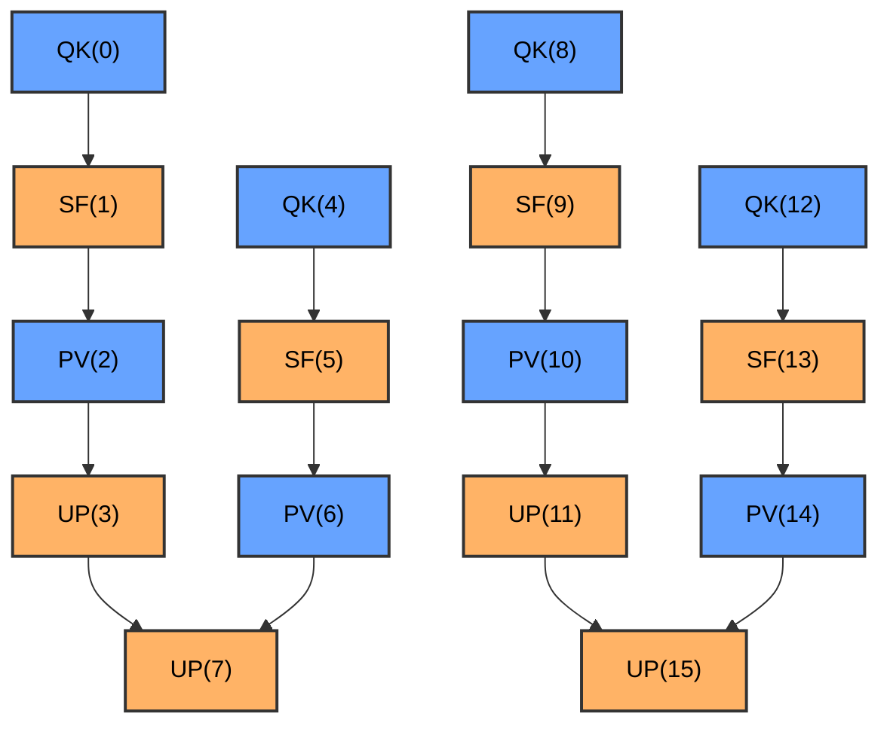

# Swimlane Performance Analysis Tools

This directory contains performance analysis tools for PTO Runtime.

## Tool List

- **[swimlane_converter.py](#swimlane_converterpy)** - Convert to Chrome Trace Event visualization format
- **[sched_overhead_analysis.py](#sched_overhead_analysispy)** - Scheduler overhead analysis (Tail OH breakdown)
- **[perf_to_mermaid.py](#perf_to_mermaidpy)** - Convert to Mermaid dependency graph
- **[benchmark_rounds.sh](#benchmark_roundssh)** - Batch-run examples and report per-round timing
- **[benchmark_config.json](#benchmark_configjson)** - Configuration file for benchmark_rounds.sh
- **[device_log_resolver.py](#device_log_resolverpy)** - Device log path resolution library

---

## swimlane_converter.py

Converts performance data JSON files to Chrome Trace Event format for visualization in Perfetto.

### Overview

`swimlane_converter.py` converts PTO Runtime performance data (`perf_swimlane_*.json`, version 1 or 2) into a format viewable in the Perfetto trace viewer (https://ui.perfetto.dev/). It also provides per-function task execution statistics with Exec/Latency analysis, and automatically runs the scheduler overhead deep-dive report when a device log is resolved.

For version 2 data, additional tracks are generated:
- **AICPU Scheduler**: scheduler phase bars per thread
- **AICPU Orchestrator**: orchestrator phase bars or summary

### Basic Usage

```bash
# Auto-detect the latest performance data file in outputs/
python3 tools/swimlane_converter.py

# Specify an input file
python3 tools/swimlane_converter.py outputs/perf_swimlane_20260210_143526.json

# Specify an output file
python3 tools/swimlane_converter.py outputs/perf_swimlane_20260210_143526.json -o custom_output.json

# Load function name mapping from kernel_config.py
python3 tools/swimlane_converter.py outputs/perf_swimlane_20260210_143526.json \
    -k examples/host_build_graph/paged_attention/kernels/kernel_config.py

# Use a specific device id for automatic device log selection (device-<id>)
python3 tools/swimlane_converter.py outputs/perf_swimlane_20260210_143526.json -d 0

# Verbose mode (for debugging)
python3 tools/swimlane_converter.py outputs/perf_swimlane_20260210_143526.json -v
```

### Command-Line Options

| Option | Short | Description |
|--------|-------|-------------|
| `input` | | Input JSON file (perf_swimlane_*.json). If omitted, uses the latest file in outputs/ |
| `--output` | `-o` | Output JSON file (default: outputs/merged_swimlane_<timestamp>.json) |
| `--kernel-config` | `-k` | Path to kernel_config.py for function name mapping |
| `--device-log` | | Device log file/path/glob override (highest priority) |
| `--device-id` | `-d` | Device id for automatic log selection from `device-<id>` directory |
| `--verbose` | `-v` | Enable verbose output |

### Device Log Selection Priority

`swimlane_converter.py` and `sched_overhead_analysis.py` use consistent resolution rules (provided by `device_log_resolver.py`):

1. `--device-log` (file/directory/glob) explicit override
2. `-d/--device-id` selects from the `device-<id>` directory
3. Auto-scan all `device-*` directories, choosing the `.log` closest to the perf timestamp

Log root resolution order:
- `$ASCEND_WORK_PATH/log/debug/`
- `~/ascend/log/debug/` (fallback)

### Output

The tool generates three types of output:

#### 1. Perfetto JSON File

A Chrome Trace Event format JSON file viewable in Perfetto:
- File location: `outputs/merged_swimlane_<timestamp>.json`
- Open https://ui.perfetto.dev/ and drag the file in to visualize

Trace processes (tracks):
- **AICore View** (pid=1): kernel execution (start_time_us to end_time_us)
- **AICPU View** (pid=2): end-to-end AICPU perspective (dispatch_time_us to finish_time_us)
- **AICPU Scheduler** (pid=3): scheduler phase bars per thread (version 2 only)
- **AICPU Orchestrator** (pid=4): orchestrator phase bars or summary (version 2 only)

#### 2. Task Statistics

A per-function summary printed to the console, including Exec/Latency comparison and scheduling overhead analysis:

- **Exec**: Kernel execution time on AICore (end_time - start_time)
- **Latency**: End-to-end latency from AICPU perspective (finish_time - dispatch_time, includes Head OH + Exec + Tail OH)
- **Head/Tail OH**: Scheduling head/tail overhead
- **Exec_%**: Exec / Latency percentage (kernel utilization)

When a device log is resolved, also outputs Sched CPU (AICPU scheduler thread actual CPU time per task) and Exec/Sched_CPU ratio.

#### 3. Scheduler Overhead Deep Dive (automatic)

When a device log is successfully resolved, `swimlane_converter.py` directly invokes the `sched_overhead_analysis` analysis logic and outputs in the same run:

- Part 1: Per-task time breakdown
- Part 2: AICPU scheduler loop breakdown
- Part 3: Tail OH distribution & cause analysis

### Integration with run_example.py

When running tests with profiling enabled, the converter is automatically invoked:

```bash
# Run a test with profiling enabled — merged_swimlane.json is auto-generated after the test passes
python examples/scripts/run_example.py \
    -k examples/host_build_graph/vector_example/kernels \
    -g examples/host_build_graph/vector_example/golden.py \
    --enable-profiling
```

After the test passes, the tool will:
1. Auto-detect the latest `perf_swimlane_*.json` in outputs/
2. Load function names from the kernel_config.py specified by `-k`
3. Pass the runtime device id (`-d`) through to `swimlane_converter.py`
4. Auto-resolve the device log and print the selection strategy
5. Generate `merged_swimlane_*.json` for visualization
6. Print task statistics and the scheduler overhead deep-dive report to the console

---

## sched_overhead_analysis.py

Analyzes AICPU scheduler overhead, quantitatively breaking down the sources of Tail OH (the delay between task completion and scheduler acknowledgment).

### Overview

`sched_overhead_analysis.py` performs analysis from two data sources:
1. **Perf profiling data** (`perf_swimlane_*.json`): Extracts per-task Exec / Head OH / Tail OH time breakdown
2. **Scheduler loop breakdown** with two sources (in priority order):
   - **Perf JSON phase data** (version >= 2, preferred): Reads `aicpu_scheduler_phases` records directly from the perf JSON
   - **Device log** (fallback for older data or `PTO2_SCHED_PROFILING=1` details)

Device log supports two formats:
1. **New two-level tree** (`PTO2_SCHED_PROFILING=1`): `=== Scheduler Phase Breakdown: total=Xus, Y tasks ===`, followed by per-phase lines with fanout/fanin/pop statistics
2. **Summary** (`PTO2_SCHED_PROFILING=0`): `Scheduler summary: total_time=Xus, loops=Y, tasks_scheduled=Z`

### Basic Usage

```bash
# Auto-select the latest perf data and device log
python3 tools/sched_overhead_analysis.py

# Specify device id for automatic log selection from device-<id>
python3 tools/sched_overhead_analysis.py --perf-json outputs/perf_swimlane_20260210_143526.json -d 0

# Specify files explicitly
python3 tools/sched_overhead_analysis.py \
    --perf-json outputs/perf_swimlane_20260210_143526.json \
    --device-log ~/ascend/log/debug/device-0/device-*.log
```

### Command-Line Options

| Option | Description |
|--------|-------------|
| `--perf-json` | Path to perf_swimlane_*.json file. If omitted, auto-selects the latest in outputs/ |
| `--device-log` | Device log file/path/glob override (highest priority) |
| `-d, --device-id` | Device id for automatic log selection from `device-<id>` |

### Output

Output is divided into three parts:

- **Part 1: Per-task time breakdown** — Exec / Head OH / Tail OH as percentages of Latency
- **Part 2: AICPU scheduler loop breakdown** — Per-thread loop statistics, phase breakdown (scan / complete / dispatch / idle) with time percentages, fanout/fanin/pop statistics. Data source is either perf JSON phase data (version >= 2) or device log (fallback)
- **Part 3: Tail OH distribution & cause analysis** — Tail OH percentile distribution (P10–P99), correlation analysis between scheduler loop iteration time and Tail OH, data-driven insights on the dominant phase

---

## perf_to_mermaid.py

Converts performance data into Mermaid flowchart format to visualize task dependencies.

### Overview

`perf_to_mermaid.py` converts PTO Runtime performance data (`perf_swimlane_*.json`) into Mermaid flowchart format. The generated Markdown file can be:
- Rendered directly in GitHub/GitLab
- Viewed at https://mermaid.live/
- Viewed in editors with Mermaid support (e.g., VS Code + Mermaid extension)

### Basic Usage

```bash
# Auto-detect the latest performance data file in outputs/
python3 tools/perf_to_mermaid.py

# Specify an input file
python3 tools/perf_to_mermaid.py outputs/perf_swimlane_20260210_143526.json

# Specify an output file
python3 tools/perf_to_mermaid.py outputs/perf_swimlane_20260210_143526.json -o diagram.md

# Load function name mapping from kernel_config.py
python3 tools/perf_to_mermaid.py outputs/perf_swimlane_20260210_143526.json \
    -k examples/host_build_graph/paged_attention/kernels/kernel_config.py

# Use compact style (shows only task ID)
python3 tools/perf_to_mermaid.py outputs/perf_swimlane_20260210_143526.json --style compact

# Specify flowchart direction (left to right)
python3 tools/perf_to_mermaid.py outputs/perf_swimlane_20260210_143526.json --direction LR

# Verbose mode
python3 tools/perf_to_mermaid.py outputs/perf_swimlane_20260210_143526.json -v
```

### Command-Line Options

| Option | Short | Description |
|--------|-------|-------------|
| `input` | | Input JSON file (perf_swimlane_*.json). If omitted, uses the latest file in outputs/ |
| `--output` | `-o` | Output Markdown file (default: outputs/mermaid_diagram_<timestamp>.md) |
| `--kernel-config` | `-k` | Path to kernel_config.py for function name mapping |
| `--style` | | Node style: `detailed` (default, shows function name and task ID) or `compact` (task ID only) |
| `--direction` | | Flowchart direction: `TD` (top-down, default) or `LR` (left-right) |
| `--verbose` | `-v` | Enable verbose output |

### Output

Generates a Markdown file containing a Mermaid flowchart:

#### Detailed Style (default)



---

## benchmark_rounds.sh

Batch-runs predefined examples on hardware, parses device log timing lines, and reports per-round latency with statistical analysis.

### Overview

`benchmark_rounds.sh` loads configuration from `benchmark_config.json`, iterates over the configured example list (under `tests/device_tests/<platform>/tensormap_and_ringbuffer/` by default), invokes `run_example.py` for each example, then extracts `orch_start` / `end` timestamps from the generated device log to compute per-round elapsed time. It supports warm-up rounds (discarded before statistics), and reports mean, median, trimmed mean, range, MAD, standard deviation, and fluctuation rate (CV). Optionally generates scatter plot PNGs and saves statistics logs.

Currently configured examples (in `benchmark_config.json`):
- `alternating_matmul_add`
- `benchmark_bgemm`
- `paged_attention_unroll`
- `batch_paged_attention`
- `paged_attention`

### Basic Usage

```bash
# Use defaults from benchmark_config.json (device 0, 10 rounds, 2 warmup, platform a2a3)
./tools/benchmark_rounds.sh

# Specify a custom config file
./tools/benchmark_rounds.sh -c path/to/config.json

# Specify platform, device, rounds, and warmup
./tools/benchmark_rounds.sh -p a2a3 -d 4 -n 20 -w 3

# Enable verbose output and scatter plots
./tools/benchmark_rounds.sh -v --plot

# Extra arguments are passed through to run_example.py
./tools/benchmark_rounds.sh -d 0 -n 5 --case 1
```

### Command-Line Options

| Option | Short | Description |
|--------|-------|-------------|
| `--config` | `-c` | Path to JSON config file (default: benchmark_config.json next to the script) |
| `--platform` | `-p` | Platform to run on (config default: `a2a3`) |
| `--device` | `-d` | Device ID (config default: `0`) |
| `--rounds` | `-n` | Number of measured rounds per example (config default: `10`) |
| `--warmup` | `-w` | Number of warm-up rounds to discard (config default: `2`) |
| `--verbose` | `-v` | Print detailed run_example.py output (config default: false) |
| `--plot` | | Generate scatter plot PNG for each example (config default: false) |
| `--log` | | Save statistics to `benchmark_logs/` for each example (config default: true) |
| `--help` | `-h` | Show help message |

All unrecognized arguments are passed through to `run_example.py`. CLI arguments override values from the config file.

### Output

For each example:
- Per-round elapsed time in microseconds, with warm-up rounds clearly marked
- Mean, median, and trimmed mean (excluding min & max)
- Range (max - min), mean absolute deviation (MAD), standard deviation, and fluctuation rate (CV%)
- Optional scatter plot PNG (with `--plot`)
- Optional statistics log file in `benchmark_logs/` (with `--log`)

Final summary: passed / failed count.

### Device Log Resolution

The script locates device logs as follows:
- Uses `$ASCEND_WORK_PATH/log/debug/device-<id>/` first
- Falls back to `~/ascend/log/debug/device-<id>/`
- Snapshots existing log files before running, then waits for a new log file to appear (up to 15 seconds)

---

## benchmark_config.json

Configuration file for `benchmark_rounds.sh`. Defines default settings and the list of examples to benchmark.

### Fields

| Field | Type | Default | Description |
|-------|------|---------|-------------|
| `project_root` | string | `".."` | Relative path from the script to the project root |
| `examples_subdir` | string | `"tests/device_tests/${platform}/tensormap_and_ringbuffer"` | Subdirectory under project root containing examples. `${platform}` is substituted at runtime |
| `examples` | list | | List of example directory names to benchmark |
| `device_id` | int | `0` | Default device ID |
| `rounds` | int | `10` | Default number of measured rounds |
| `warmup_rounds` | int | `2` | Default number of warm-up rounds |
| `platform` | string | `"a2a3"` | Default platform |
| `verbose` | bool | `false` | Whether to print detailed output |
| `log` | bool | `true` | Whether to save statistics logs |
| `plot` | bool | `false` | Whether to generate scatter plots |

---

## device_log_resolver.py

Device log path resolution library, used by both `swimlane_converter.py` and `sched_overhead_analysis.py`.

### Overview

`device_log_resolver.py` provides deterministic device log path resolution logic, supporting three selection priorities:

1. **Explicit path** (`--device-log`): Supports file, directory, or glob pattern
2. **Device ID** (`--device-id`): Selects the newest `.log` from `<log_root>/device-<id>/`
3. **Auto-scan**: Traverses all `device-*` directories, selecting the `.log` closest to the perf timestamp

### Main Functions

| Function | Description |
|----------|-------------|
| `get_log_root()` | Returns the log root path (`$ASCEND_WORK_PATH/log/debug/` or `~/ascend/log/debug/`) |
| `infer_device_id_from_log_path(log_path)` | Infers device id from the path (e.g., `device-0`) |
| `resolve_device_log_path(device_id, device_log, perf_path)` | Resolves device log path by priority, returns `(Path, strategy_string)` |

### Usage

This module is not used as a standalone command-line tool; it is imported by other tools:

```python
from device_log_resolver import resolve_device_log_path

log_path, strategy = resolve_device_log_path(
    device_id="0",
    device_log=None,
    perf_path=Path("outputs/perf_swimlane_20260210_143526.json"),
)
```

---

## Common Configuration

### Input File Format

The analysis tools share the same input format — `perf_swimlane_*.json` files generated by PTO Runtime:

```json
{
  "version": 1,
  "tasks": [
    {
      "task_id": 0,
      "func_id": 0,
      "core_id": 0,
      "core_type": "aic",
      "start_time_us": 100.0,
      "end_time_us": 250.5,
      "duration_us": 150.5,
      "kernel_ready_time_us": 95.0,
      "fanout": [1, 2],
      "fanout_count": 2
    }
  ]
}
```

Version 2 data additionally includes `aicpu_scheduler_phases`, `aicpu_orchestrator`, `aicpu_orchestrator_phases`, and `core_to_thread` fields.

### Kernel Config Format

To display meaningful function names in the output, provide a `kernel_config.py` file:

```python
KERNELS = [
    {
        "func_id": 0,
        "name": "QK",
        # ... other fields
    },
    {
        "func_id": 1,
        "name": "SF",
        # ... other fields
    },
]
```

The tools extract a `func_id` to `name` mapping from the `KERNELS` list.

---

## Tool Selection Guide

### Use swimlane_converter.py when you need to:
- View a detailed timeline execution view
- Analyze task scheduling across different cores
- See precise execution times and intervals
- Get task execution statistics
- Perform professional performance analysis and optimization

### Use perf_to_mermaid.py when you need to:
- Quickly view task dependencies
- Embed dependency graphs in documentation
- Share dependency structure in code reviews
- Focus on topology rather than timeline details
- View directly in GitHub/GitLab

### Use benchmark_rounds.sh when you need to:
- Batch-run multiple examples and compare timing
- Get per-round elapsed time with statistical analysis
- Run end-to-end performance regression tests on hardware

### Recommended Workflow

```bash
# 1. Run a test to collect performance data
python examples/scripts/run_example.py -k ./kernels -g ./golden.py --enable-profiling

# 2. Generate Perfetto visualization (automatic)
# → outputs/merged_swimlane_*.json

# 3. Generate Mermaid dependency graph
python3 tools/perf_to_mermaid.py -k ./kernels/kernel_config.py

# 4. Batch benchmark (on hardware)
./tools/benchmark_rounds.sh -d 0 -n 20

# 5. Analyze results
# - Detailed performance analysis: Perfetto (https://ui.perfetto.dev/)
# - Dependency overview: Mermaid diagram (GitHub / editor)
# - Statistical summary: console output
```

---

## Troubleshooting

### Error: Cannot find perf_swimlane_*.json file
- Make sure you ran the test with the `--enable-profiling` flag
- Check that the outputs/ directory exists and contains performance data

### Warning: Kernel entry missing 'func_id' or 'name'
- Check the kernel_config.py file format
- Ensure all KERNELS entries have 'func_id' and 'name' fields

### Error: Unsupported version
- The tools support version 1 and version 2 performance data formats
- Regenerate performance data using the latest runtime if needed

### Error: Perf JSON missing required fields for scheduler overhead analysis
- This error indicates that the input `perf_swimlane_*.json` is missing fields needed for the deep-dive analysis (typically `dispatch_time_us` / `finish_time_us`)
- The basic conversion by `swimlane_converter.py` can still succeed, but the deep-dive will be skipped or fail
- Resolution:
  1. Re-run with `--enable-profiling` to generate a new `outputs/perf_swimlane_*.json`
  2. Re-run `swimlane_converter.py` or `sched_overhead_analysis.py`
  3. Verify that each task in the JSON includes `dispatch_time_us` and `finish_time_us`

### benchmark_rounds.sh has no timing data
- Ensure profiling was enabled at runtime (`PTO2_PROFILING` environment variable)
- Check that the device log directory is accessible
- Confirm the log contains `orch_start` / `end` timestamp lines

### Mermaid diagram does not render on GitHub
- Ensure the file has a `.md` extension
- Check that the Mermaid syntax is correct
- GitHub may need a refresh to render Mermaid diagrams

---

## Output File Reference

| File | Tool | Purpose | Format |
|------|------|---------|--------|
| `perf_swimlane_*.json` | Runtime | Raw performance data | JSON |
| `merged_swimlane_*.json` | swimlane_converter.py | Perfetto visualization | Chrome Trace Event JSON |
| `mermaid_diagram_*.md` | perf_to_mermaid.py | Dependency graph | Markdown + Mermaid |
| `benchmark_logs/*.log` | benchmark_rounds.sh | Benchmark statistics | Text |
| `benchmark_logs/*.png` | benchmark_rounds.sh | Scatter plots (optional) | PNG image |

---

## Related Resources

- [Perfetto Trace Viewer](https://ui.perfetto.dev/)
- [Mermaid Live Editor](https://mermaid.live/)
- [Mermaid Documentation](https://mermaid.js.org/)
